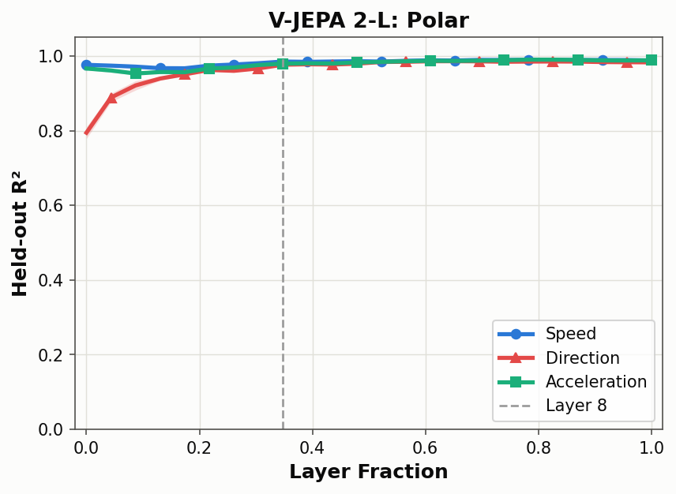
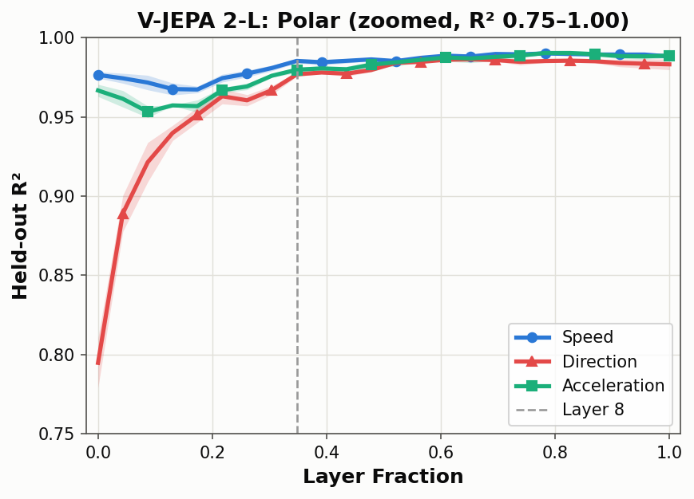

# Layer-wise probing (Part 1.1)

Where inside V-JEPA 2-L do speed, acceleration and direction become linearly
readable? For each of the encoder's 24 layers, a linear probe is trained on the
frozen, mean-pooled features of every clip, and scored on clips whose values it never
saw during training. This reproduces Figure 2c of Joseph et al.,
[*Interpreting Physics in Video World Models*](https://arxiv.org/abs/2602.07050).



*Our reproduction of the paper's Figure 2c. Held-out R² at every layer, for all three
variables. The shaded bands are ±1 standard deviation across 5 folds, as in the paper;
ours are thinner than the lines almost everywhere because the folds agree closely.
The markers tell the lines apart without relying on colour. The dashed line marks
layer 8, the paper's one-third-depth "Physics Emergence Zone".*



*The same data zoomed in to R² 0.75–1.00, to show the detail the full scale hides:
direction's climb through the first few layers, acceleration's small dip around
layers 2–4, and direction settling slightly below the other two from the middle
layers on. **The y-axis does not start at zero**, so differences look larger than
they are. Compare against the paper using the full-scale figure above.*

## Result

- **Speed and acceleration are readable from the first block** (R² 0.977 and 0.967)
  and stay high throughout, as the paper finds.
- **Direction is the weakest variable early on** (0.795, a mean error of 17°) and
  improves the most with depth, reaching 0.977 (4.4°) by layer 8, as the paper finds.
- **But direction rises gradually**, mostly by layer 5, instead of jumping at layer 8
  from about 0.2 to 0.9 as in the paper. So the paper's central claim, a sharp
  emergence of direction at one-third depth, is **only partially reproduced**.
- From layer 12 onward, all three variables sit between R² 0.983 and 0.990.

| Variable | Layer 0 | Layer 8 | Peak | Details |
|---|---|---|---|---|
| Speed | 0.977 | 0.985 | 0.990 (layer 18) | [speed](speed/README.md) |
| Acceleration | 0.967 | 0.980 | 0.990 (layer 19) | [acceleration](acceleration/README.md) |
| Direction | 0.795 (17.2°) | 0.977 (4.4°) | 0.986 (layer 15) | [direction](direction/README.md) |

Direction's numbers in brackets are its mean angular error. Each variable's write-up
covers its verification and limitations; the direction write-up also discusses why
the result may differ from the paper.

## Method, in brief

The encoder, [`facebook/vjepa2-vitl-fpc64-256`](https://huggingface.co/facebook/vjepa2-vitl-fpc64-256),
is frozen. Features are the residual stream after each block, averaged over all 2,048
space-time tokens. Each probe is linear, trained with Adam, and the best of the
paper's 20 learning-rate and weight-decay settings is chosen on a validation split.
Scores come from 5-fold cross-validation grouped by label value, so every test value
is unseen in training. Direction is predicted as (sin θ, cos θ). The full protocol is
in the [speed write-up](speed/README.md#setup).

Two differences from the paper's figure are deliberate: the y-axis reads "Held-out R²",
because our scores come from test folds never used to choose settings; and the
markers were added for colour-blind readers.

## Regenerate the figure

```bash
python scripts/03_polar_figure.py
```

It reads the three probing results from `artifacts/results/` and writes both
versions, `fig2c_polar.png` and `fig2c_polar_zoom.png`, to `artifacts/results/figures/`;
the figures here are copies of those files.
