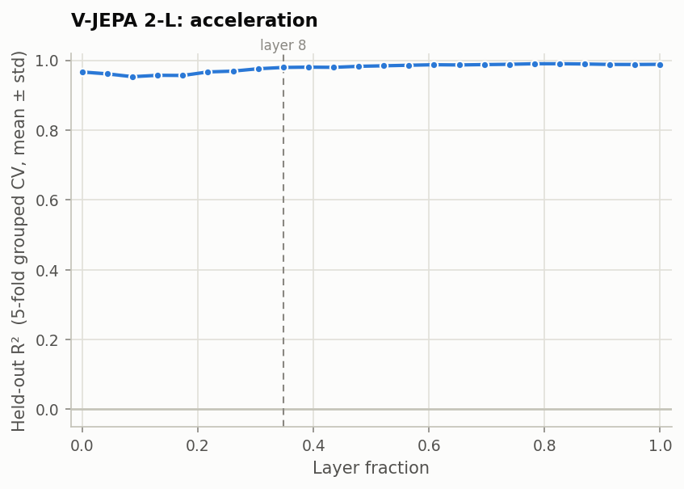

# Layer-wise probing: acceleration

Part 1.1 of the take-home, for the acceleration variable. It reproduces the
acceleration curve in Figure 2c of Joseph et al., [*Interpreting Physics in Video World Models*](https://arxiv.org/abs/2602.07050).

## Summary

**Acceleration is linearly readable from V-JEPA 2-L at every layer.** A linear probe
reaches R² = 0.967 after the first transformer block, dips to 0.953 at layer 2,
rises through layer 8, and peaks at 0.990 at layers 18–20, holding to the output.
This reproduces the paper's finding that acceleration magnitude, like speed, is
available from the earliest layers.

As with speed, near-ceiling R² hides one real change: the unexplained variance
**falls from 4.3% at layer 4 to 2.0% at layer 8**, the depth of the paper's "Physics
Emergence Zone". Acceleration is present from block 0, and refined there.

One caveat governs how to read this: every clip starts from rest, so in this dataset
acceleration cannot be told apart from how far the disk travels (see
[Limitations](#limitations)).

| Paper layer | 0 | 2 | 4 | 8 | 16 | 19 | 23 |
|---|---|---|---|---|---|---|---|
| Held-out R² | 0.967 ± 0.004 | 0.953 ± 0.004 | 0.957 ± 0.004 | 0.980 ± 0.002 | 0.988 ± 0.002 | **0.990 ± 0.001** | 0.989 ± 0.001 |
| Mean absolute error (m/s²) | 0.413 | 0.485 | 0.465 | 0.320 | 0.237 | 0.219 | 0.240 |

---

## Setup

| | |
|---|---|
| Model | [`facebook/vjepa2-vitl-fpc64-256`](https://huggingface.co/facebook/vjepa2-vitl-fpc64-256), frozen: 24 transformer blocks, hidden size 1024 |
| Data | the `acceleration` dataset: 1,536 clips of a single disk, 64 accelerations evenly spaced from 0.25 to 10.0 m/s², 24 clips each, each at a different direction. **Every clip starts from rest.** 16 frames at 256×256, 24 fps |
| Target | `acceleration_mps2`, the acceleration magnitude (identical to the dataset's `magnitude` column) |
| Features | the residual stream after each block, mean-pooled over all 2,048 space-time tokens |
| Probe | linear, `f(h) = Wh + b`, trained with Adam on MSE for 50 epochs |
| Model selection | the best of 20 configurations (learning rate ∈ {1e-4, 3e-4, 1e-3, 3e-3, 5e-3} × weight decay ∈ {0.01, 0.1, 0.4, 0.8}), chosen on a validation split |
| Evaluation | 5-fold cross-validation **grouped by acceleration value**, reporting the mean ± standard deviation of held-out R² across folds |

The protocol is identical to the speed probe's. Each test fold holds about 13
acceleration values, roughly 300 clips, that the probe never trained on, and values
are dealt to folds in sorted order so every fold spans the full range. The layer
numbering and the choices the paper leaves unstated are described in the
[speed write-up](../speed/README.md#setup) and apply unchanged.

One addition: the paper gives 50 epochs for speed but no epoch count for
acceleration. We used speed's 50, and the convergence check below confirms it is
enough.

---

## Result



*Figure 1. Held-out R² for acceleration at each of the 24 layers. The shaded band is
±1 standard deviation across the five folds; it is narrower than the line almost
everywhere. The dashed line marks layer 8, the paper's one-third-depth "Physics
Emergence Zone".*

**Against the paper.** Reading from its Figure 2c, the paper reports acceleration at
about 0.8 at layer fraction 0, rising to about 0.9 after layer 8 and staying flat to
the output. We see the same shape: available from the start, an early dip, a rise
around layer 8, and no decline toward the output. Our values are higher. Plausible
reasons are 5.5 times more clips (1,536 against 280) and 64 acceleration values
rather than 5.

**Against speed.** Acceleration trails speed through the early layers, then catches
up; from layer 12 onward the two are indistinguishable, and both peak at 0.990:

| Paper layer | 0 | 2 | 4 | 8 | 12 | 16 | 19 | 23 |
|---|---|---|---|---|---|---|---|---|
| Acceleration R² | 0.967 | 0.953 | 0.957 | 0.980 | 0.985 | 0.988 | 0.990 | 0.989 |
| Speed R² | 0.977 | 0.972 | 0.967 | 0.985 | 0.985 | 0.990 | 0.990 | 0.988 |

Once the labels' spread is accounted for, the two are read equally precisely: the
error at the peak is 7.6% of the label standard deviation for acceleration (2.86
m/s²) and 8.0% for speed (1.10 m/s).

**Near the ceiling, R² hides a real change.** Acceleration doesn't *emerge* at layer
8, since it is present from block 0, but its representation is **sharpened** there:

| Paper layer | 0 | 2 | 4 | 8 | 16 | 19 |
|---|---|---|---|---|---|---|
| Unexplained variance (1 − R²) | 3.3% | 4.7% | 4.3% | 2.0% | 1.2% | 1.0% |
| Mean absolute error (m/s²) | 0.413 | 0.485 | 0.465 | 0.320 | 0.237 | 0.219 |

The unexplained variance falls by more than half between layers 4 and 8, and almost
fivefold from its worst (layer 2) to its best (layer 19). For speed the same drop was
about threefold, so depth helps acceleration more. One possible reason is that
acceleration is a *change* in motion over the clip, which may take more processing
across time than speed does. Given the caveat below, that is a hypothesis, not a
finding.

---

## Verification

| Check | Result |
|---|---|
| No acceleration value shared between the training, validation and test parts of any fold | 0 shared, and every clip tested exactly once. The pipeline enforces this and stops if it is violated |
| Training twice as long | R² changes by +0.004, +0.004 and +0.002 at layers 0, 8 and 16: well within the 0.02 threshold, so 50 epochs is enough. All three are positive, so the probes were still improving very slightly |
| Model selection | validation R² 0.978 against test R² 0.979, so no optimistic bias |
| Learning-rate grid | 7 of 120 selections chose the grid's highest learning rate (5 × 10⁻³), all at layers 1 and 2. Those two layers may be very slightly underestimated. Every other selection lies inside the paper's grid |
| Metric and averaging code | verified independently on the speed run (recomputed with scikit-learn, and cross-checked with closed-form ridge regression); unchanged since |

**Provenance.** Features were extracted on a Tesla T4 with fp16 autocast, from commit
`54efc92`, which contains every change this run needed. The extraction metadata
flags the working tree as not clean. That was caused by an untracked results archive
from the previous session left in the project folder, not by any code change.

---

## Limitations

- **Every clip starts from rest.** Acceleration therefore fixes both the distance the
  disk travels (½·a·t²) and its final speed (a·t). So in this dataset, a probe that
  reads acceleration cannot be told apart from one that reads distance travelled.
  The paper's dataset has the same design, and none of the supplied datasets varies
  starting speed and acceleration together, so this cannot be resolved here.
- **The low end is nearly static.** At 0.25 m/s² the disk moves about 1.2 px across
  the whole clip, against 64 px at 10 m/s². Errors are expected to be larger at the
  smallest accelerations, but per-value error was not measured, as that goes beyond
  the brief. The paper's accelerations started at 2 m/s².
- **Layers 1–2 may be slightly underestimated**, because their best learning rate lies
  at the edge of the paper's grid (see Verification).
- **Readable is not the same as used.** A linear probe shows acceleration is
  *available* at a layer, not that the model *uses* it.
- **Mean pooling discards where and when**; the paper's patch-preserving attentive-MLP
  probes are not run here.
- **16 frames per clip**, against the checkpoint's 64-frame training clips; and **one
  simple synthetic dataset**.

---

## Reproduce

```bash
python scripts/01_extract.py --dataset acceleration              # ~4.5 min on a T4
python scripts/02_layerwise_probe.py --variable acceleration     # ~5 min on a T4
```

The figure in this folder is a copy of `artifacts/results/acceleration/figures/layerwise.png`.

---

## Appendix A: every layer

| Layer | Fraction | R² (grouped CV) | MAE (m/s²) | 1 − R² |
|---:|---:|---|---:|---:|
| 0 | 0.00 | 0.967 ± 0.004 | 0.413 | 3.3% |
| 1 | 0.04 | 0.961 ± 0.005 | 0.445 | 3.9% |
| 2 | 0.09 | 0.953 ± 0.004 | 0.485 | 4.7% |
| 3 | 0.13 | 0.957 ± 0.000 | 0.465 | 4.3% |
| 4 | 0.17 | 0.957 ± 0.004 | 0.465 | 4.3% |
| 5 | 0.22 | 0.967 ± 0.002 | 0.417 | 3.3% |
| 6 | 0.26 | 0.969 ± 0.002 | 0.397 | 3.1% |
| 7 | 0.30 | 0.976 ± 0.001 | 0.349 | 2.4% |
| 8 | 0.35 | 0.980 ± 0.002 | 0.320 | 2.0% |
| 9 | 0.39 | 0.981 ± 0.001 | 0.314 | 1.9% |
| 10 | 0.43 | 0.980 ± 0.002 | 0.317 | 2.0% |
| 11 | 0.48 | 0.983 ± 0.002 | 0.294 | 1.7% |
| 12 | 0.52 | 0.985 ± 0.003 | 0.281 | 1.5% |
| 13 | 0.57 | 0.986 ± 0.001 | 0.263 | 1.4% |
| 14 | 0.61 | 0.988 ± 0.002 | 0.244 | 1.2% |
| 15 | 0.65 | 0.987 ± 0.003 | 0.253 | 1.3% |
| 16 | 0.70 | 0.988 ± 0.002 | 0.237 | 1.2% |
| 17 | 0.74 | 0.989 ± 0.001 | 0.231 | 1.1% |
| 18 | 0.78 | 0.990 ± 0.001 | 0.219 | 1.0% |
| 19 | 0.83 | 0.990 ± 0.001 | 0.219 | 1.0% |
| 20 | 0.87 | 0.990 ± 0.001 | 0.225 | 1.0% |
| 21 | 0.91 | 0.988 ± 0.002 | 0.242 | 1.2% |
| 22 | 0.96 | 0.988 ± 0.002 | 0.240 | 1.2% |
| 23 | 1.00 | 0.989 ± 0.001 | 0.240 | 1.1% |
