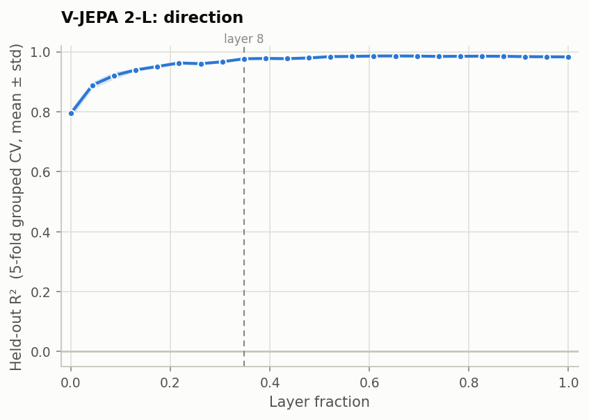

# Layer-wise probing: direction

Part 1.1 of the take-home, for the direction variable. It reproduces the direction
curve in Figure 2c of Joseph et al., [*Interpreting Physics in Video World Models*](https://arxiv.org/abs/2602.07050),
and it is where our result departs from the paper.

## Summary

**Direction is linearly readable from V-JEPA 2-L at every layer, and this is a
partial reproduction of the paper.** A linear probe reads direction with R² = 0.795
(a mean error of 17°) after the first transformer block, improves quickly, and
reaches R² = 0.986 (3.4°) by the middle layers, holding to the output. Most of the
improvement is early: 88% of the total gain is reached by layer 5, and 95% by
layer 8.

| | Paper | Ours |
|---|---|---|
| Direction is the weakest of the three variables in the early layers | ✅ | ✅ 20.5% unexplained variance at layer 0, against 2.3% for speed and 3.3% for acceleration |
| Direction gains the most with depth | ✅ | ✅ its unexplained variance falls ninefold by layer 8 |
| **A sharp transition at layer 8, from about 0.2 to about 0.9** | ✅ | ❌ **it starts at 0.8 and rises gradually, mostly complete by layer 5** |

So the ordering reproduces: direction lags the magnitudes and is built up with
depth. The paper's central claim, that direction becomes readable only at a sharp
one-third-depth "Physics Emergence Zone", does not. An independent method finds
direction *more* readable in the early layers than our probe does, so the gap to the
paper is not an artefact of our probe (see [Verification](#verification)).

| Paper layer | 0 | 1 | 4 | 8 | 12 | 16 | 23 |
|---|---|---|---|---|---|---|---|
| Held-out R² | 0.795 ± 0.016 | 0.889 ± 0.011 | 0.951 ± 0.005 | 0.977 ± 0.001 | 0.984 ± 0.001 | 0.986 ± 0.001 | 0.983 ± 0.003 |
| Mean circular error | 17.2° | 12.0° | 6.7° | 4.4° | 3.7° | 3.6° | 4.0° |

---

## Setup

| | |
|---|---|
| Model | [`facebook/vjepa2-vitl-fpc64-256`](https://huggingface.co/facebook/vjepa2-vitl-fpc64-256), frozen: 24 transformer blocks, hidden size 1024 |
| Data | the `direction` dataset: 1,500 clips of a single disk, 64 directions 5.625° apart, 23 or 24 clips each. Half move at constant speed (1–7 m/s), half accelerate from rest (2–10 m/s²); every direction has both kinds. 16 frames at 256×256, 24 fps |
| Target | **(sin θ, cos θ)** of the direction θ, the paper's circular regression (Appendix C.11). The probe has two outputs |
| Features | the residual stream after each block, mean-pooled over all 2,048 space-time tokens |
| Probe | linear, `f(h) = Wh + b`, trained with Adam on MSE for **100 epochs**, as the paper specifies for direction |
| Model selection | the best of 20 configurations (learning rate ∈ {1e-4, 3e-4, 1e-3, 3e-3, 5e-3} × weight decay ∈ {0.01, 0.1, 0.4, 0.8}), chosen on validation R² averaged over sin and cos |
| Evaluation | 5-fold cross-validation **grouped by direction**, reporting the mean ± standard deviation of held-out R² across folds |

**Two metrics.** R² is computed separately for sin and cos and averaged, matching the
paper's y-axis. **Circular error** is the human-readable version: the predicted
(sin, cos) pair is turned back into an angle, and the error is measured the short
way round the circle, so 359° against 1° counts as 2°. On that scale, perfect is 0°
and chance is 90°.

Each test fold holds 12 or 13 directions, roughly 300 clips, that the probe never
trained on. Directions are dealt to folds in sorted order, so every fold is spread
evenly around the circle. Because a circle has no ends, no fold ever has to
extrapolate. The layer numbering and the other choices the paper leaves unstated are
described in the [speed write-up](../speed/README.md#setup) and apply unchanged. The
angle convention is 0° right, 90° up, 180° left and 270° down.

---

## Result



*Figure 1. Held-out R² for direction, averaged over its sin and cos, at each of the
24 layers. The shaded band is ±1 standard deviation across the five folds. The dashed
line marks layer 8, where the paper places its sharp transition.*

**Against the paper.** Reading from its Figure 2c, the paper reports direction at
about 0.2 at layer fraction 0, climbing unevenly to about 0.6, then jumping at layer
8 to about 0.9. Ours starts at 0.795 and rises smoothly: most of the rise happens in
layers 0–5, before the paper's transition, and there is no step at layer 8.

**Against speed and acceleration.** Direction is clearly the weakest variable early
on, and the one that improves most with depth:

| Paper layer | 0 | 2 | 4 | 8 | 12 | 16 | 23 |
|---|---|---|---|---|---|---|---|
| Direction R² | 0.795 | 0.921 | 0.951 | 0.977 | 0.984 | 0.986 | 0.983 |
| Speed R² | 0.977 | 0.972 | 0.967 | 0.985 | 0.985 | 0.990 | 0.988 |
| Acceleration R² | 0.967 | 0.953 | 0.957 | 0.980 | 0.985 | 0.988 | 0.989 |
| Direction, unexplained variance (1 − R²) | 20.5% | 7.9% | 4.9% | 2.3% | 1.6% | 1.4% | 1.7% |

From layer 12 onward, all three variables sit between R² 0.983 and 0.990, with
direction slightly below the other two (by up to 0.005). So in our data, all three
end up nearly equally readable. What distinguishes direction is how far it has to
come, not where it ends up.

---

## Why this may differ from the paper

These are hypotheses. None has been tested.

1. **A simpler scene.** Our clips show one high-contrast disk, the only thing that
   moves, filmed from directly above. The paper renders a 3D sphere on a floor, with a
   perspective camera and lighting. A single bright blob's direction of travel may
   simply be easier to read from early representations.
2. **More data.** We have 1,500 clips covering 64 directions; the paper's velocity
   dataset has 392 clips covering 8. With about 300 training clips against 1,024
   features, a weak early-layer signal can be lost to over-fitting; with about 1,200
   it can be recovered. This hypothesis predicts the paper's shape from ours, and it
   is directly testable by cutting our data down to the paper's size. That is the most
   informative follow-up, and it is deferred, because it goes beyond the brief.
3. **How the probe is trained.** Our own evidence (below) shows that the paper's
   recipe, Adam with its 20-configuration grid, struggles to extract direction from
   the earliest layers. The paper's low early values might partly reflect the same
   difficulty rather than an absence of information.

---

## Verification

Because the result differs from the paper, the first suspect was our own new code for
the (sin, cos) target. An independent method rules that out:

| Check | Result |
|---|---|
| **Closed-form ridge regression**, with the (sin, cos) targets built from scratch rather than by our code, on the same features and folds | R² 0.879 / 0.938 / 0.963 / 0.982 / 0.991 at layers 0 / 1 / 4 / 8 / 16, against our 0.795 / 0.889 / 0.951 / 0.977 / 0.986. Ridge also trains on the validation clips |
| No direction shared between the training, validation and test parts of any fold | 0 shared, and every clip tested exactly once. The pipeline enforces this and stops if it is violated |
| Circular error recomputed from the saved held-out predictions | matches the reported values to within 3 × 10⁻⁷ degrees |
| Training twice as long (200 epochs) | R² changes by +0.015, +0.002 and +0.001 at layers 0, 8 and 16: within the 0.02 threshold, but layer 0 was still improving |
| Model selection | validation R² 0.964 against test R² 0.963, so no optimistic bias |
| Learning-rate grid | 7 of 120 selections chose the grid's lowest learning rate (10⁻⁴), at layers 4, 10, 22 and 23. Every other selection lies inside the grid |

**What the ridge check also shows.** Ridge finds direction *more* readable than our
probe does, and the gap is largest at the earliest layer: 0.084 at layer 0, falling
to 0.005 by layer 8. For speed the same gap was only 0.007. Together with layer 0
still improving at 200 epochs, this means **our curve understates direction in the
earliest layers.** Direction is available even earlier than Figure 1 shows, which
widens the gap to the paper rather than closing it.

**Provenance.** Features were extracted on a Tesla T4 with fp16 autocast, from commit
`54efc92`, with a clean working tree. Probing used the direction support added in
commit `8bc21b0`. Between those two commits no line of the extraction code changed;
the only configuration change was the direction probing entry, which extraction does
not read. So the features are exactly what `8bc21b0` would have produced.

---

## Limitations

- **Our early layers understate direction**, as the ridge check shows. The shape of
  the curve in layers 0–4 partly reflects how hard the probe finds it to train there.
- **In 142 clips (9.5%) the disk leaves the frame** before the last frame. Its
  direction is still visible in the earlier frames. The speed and acceleration
  datasets have no such clips.
- **Readable is not the same as used.** A linear probe shows direction is *available*
  at a layer, not that the model *uses* it. The steering experiment (Part 1.3)
  addresses causality.
- **Mean pooling discards where and when**; the paper's patch-preserving attentive-MLP
  probes are not run here.
- **16 frames per clip**, against the checkpoint's 64-frame training clips; and **one
  simple synthetic dataset**.

---

## Reproduce

```bash
python scripts/01_extract.py --dataset direction              # ~4.5 min on a T4
python scripts/02_layerwise_probe.py --variable direction     # ~9 min on a T4
```

The figure in this folder is a copy of `artifacts/results/direction/figures/layerwise.png`.

---

## Appendix A: every layer

| Layer | Fraction | R² (grouped CV) | Circular error | 1 − R² |
|---:|---:|---|---:|---:|
| 0 | 0.00 | 0.795 ± 0.016 | 17.2° | 20.5% |
| 1 | 0.04 | 0.889 ± 0.011 | 12.0° | 11.1% |
| 2 | 0.09 | 0.921 ± 0.012 | 9.3° | 7.9% |
| 3 | 0.13 | 0.940 ± 0.005 | 7.7° | 6.0% |
| 4 | 0.17 | 0.951 ± 0.005 | 6.7° | 4.9% |
| 5 | 0.22 | 0.963 ± 0.005 | 6.0° | 3.7% |
| 6 | 0.26 | 0.961 ± 0.004 | 6.4° | 3.9% |
| 7 | 0.30 | 0.967 ± 0.003 | 5.4° | 3.3% |
| 8 | 0.35 | 0.977 ± 0.001 | 4.4° | 2.3% |
| 9 | 0.39 | 0.978 ± 0.001 | 4.4° | 2.2% |
| 10 | 0.43 | 0.977 ± 0.002 | 4.4° | 2.3% |
| 11 | 0.48 | 0.980 ± 0.001 | 4.0° | 2.0% |
| 12 | 0.52 | 0.984 ± 0.001 | 3.7° | 1.6% |
| 13 | 0.57 | 0.985 ± 0.000 | 3.6° | 1.5% |
| 14 | 0.61 | 0.986 ± 0.001 | 3.4° | 1.4% |
| 15 | 0.65 | 0.986 ± 0.001 | 3.5° | 1.4% |
| 16 | 0.70 | 0.986 ± 0.001 | 3.6° | 1.4% |
| 17 | 0.74 | 0.985 ± 0.002 | 3.8° | 1.5% |
| 18 | 0.78 | 0.985 ± 0.001 | 3.7° | 1.5% |
| 19 | 0.83 | 0.986 ± 0.001 | 3.7° | 1.4% |
| 20 | 0.87 | 0.985 ± 0.001 | 3.8° | 1.5% |
| 21 | 0.91 | 0.984 ± 0.002 | 3.7° | 1.6% |
| 22 | 0.96 | 0.984 ± 0.003 | 3.8° | 1.6% |
| 23 | 1.00 | 0.983 ± 0.003 | 4.0° | 1.7% |
