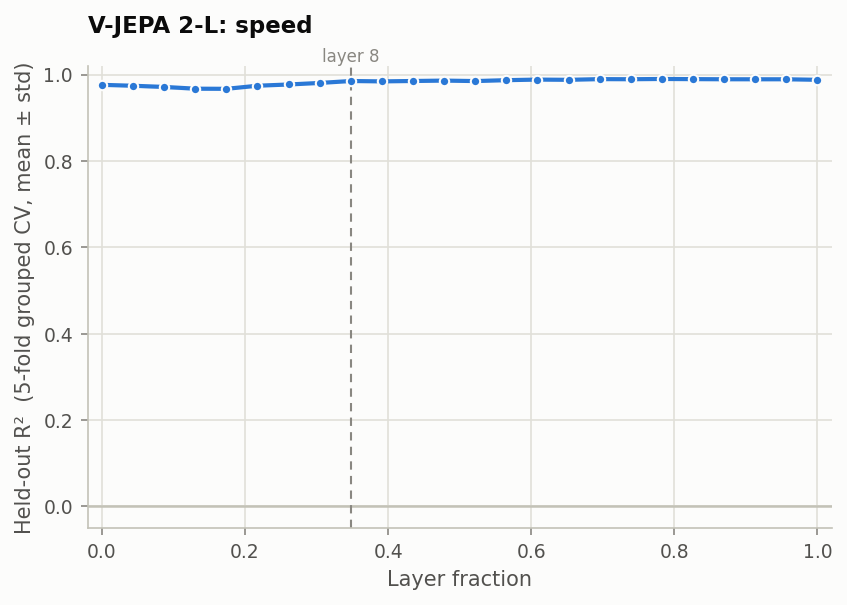
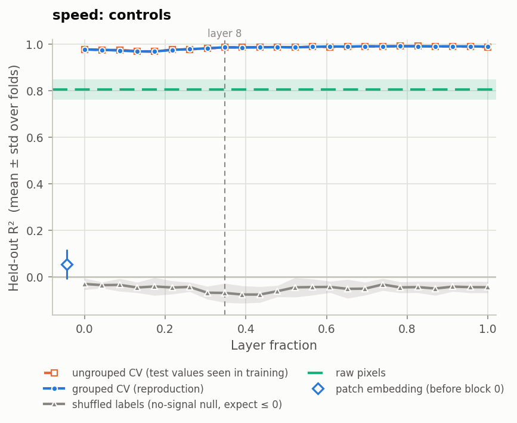
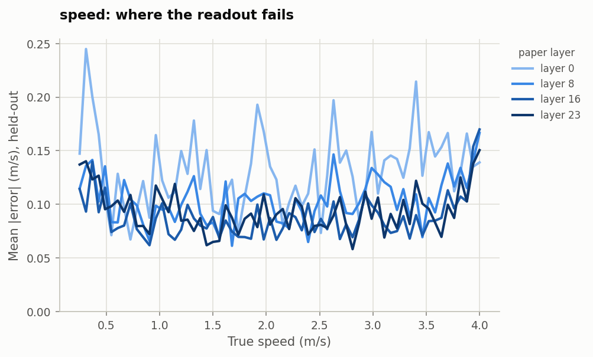

# Layer-wise probing: speed

Part 1.1 of the take-home, for the speed variable. It reproduces the speed curve in
Figure 2c of Joseph et al., [*Interpreting Physics in Video World Models*](https://arxiv.org/abs/2602.07050).

## Summary

**Speed is linearly readable from V-JEPA 2-L at every layer.** A linear probe reaches
R² = 0.977 after the first transformer block. It rises to 0.990 by layer 16 and
holds to the output. This reproduces the paper's finding that scalar motion
magnitudes are available from the earliest layers, in contrast to direction, which
the paper finds becomes readable only around one-third depth.

Three controls support the result, and the audit reproduces the headline numbers
with tools independent of the pipeline. Two findings go beyond the paper:

- Speed is **absent before the first block** (R² 0.054 on the patch embedding) and
  present after it (0.977).
- Near-ceiling R² hides a real **refinement around layer 8**: the unexplained
  variance halves between layers 4 and 8.

| Paper layer | 0 | 4 | 8 | 16 | 23 |
|---|---|---|---|---|---|
| Held-out R² | 0.977 ± 0.002 | 0.967 ± 0.002 | 0.985 ± 0.001 | **0.990 ± 0.001** | 0.988 ± 0.001 |
| Mean absolute error (m/s) | 0.131 | 0.157 | 0.105 | 0.088 | 0.094 |

---

## Setup

| | |
|---|---|
| Model | [`facebook/vjepa2-vitl-fpc64-256`](https://huggingface.co/facebook/vjepa2-vitl-fpc64-256), frozen: 24 transformer blocks, hidden size 1024 |
| Data | the `speed` dataset: 1,536 clips of a single disk, 64 speeds from 0.25 to 4.0 m/s with 24 clips each; 16 frames at 256×256, 24 fps |
| Features | the residual stream after each block, mean-pooled over all 2,048 space-time tokens |
| Probe | linear, `f(h) = Wh + b`, trained with Adam on MSE for 50 epochs |
| Model selection | the best of 20 configurations (learning rate ∈ {1e-4, 3e-4, 1e-3, 3e-3, 5e-3} × weight decay ∈ {0.01, 0.1, 0.4, 0.8}), chosen on a validation split |
| Evaluation | 5-fold cross-validation **grouped by speed value**, reporting the mean ± standard deviation of held-out R² across folds |

The protocol follows the paper's Appendix B. Grouping by speed value means each
test fold holds about 13 speeds, roughly 300 clips, that the probe **never trained
on**. The score therefore measures interpolation to unseen speeds, not recognition
of the 64 speeds seen in training. Speeds are dealt to folds in sorted order, so
every fold spans the full 0.25–4.0 m/s range. This matters because R² is measured
against each fold's own spread of labels.

**Layer numbering.** Paper layer ℓ is the output of block ℓ, which is
`hidden_states[ℓ + 1]` in HuggingFace; index 0 is the patch embedding. This mapping
was verified against the model with forward hooks. As in the paper, the x-axis is
layer ℓ / 23.

**Choices the paper leaves unstated**, and what we chose:

| Unstated in the paper | Our choice |
|---|---|
| What "grouped" cross-validation groups by | the label value, as above |
| Feature standardisation | z-scored with statistics from the training split only |
| How validation relates to the folds | a nested split: 20% of each fold's training speed values, also held out whole; the selected model is scored as-is on the test fold |
| Batch size, and therefore what "50 epochs" means | 32, which is about 1,550 updates per probe |
| Weight decay on the bias | none; the bias starts at the training-mean speed |
| Preprocessing geometry | the checkpoint's own normalisation, with resize and crop **disabled**. The clips are already 256×256, and the default resize-then-crop path discards about 16 px per edge, which clips the disk in roughly 5% of clips |

---

## Result



*Figure 1. Held-out R² for speed at each of the 24 layers. The shaded band is ±1
standard deviation across the five folds; it is narrower than the line almost
everywhere. The dashed line marks layer 8, the paper's one-third-depth "Physics
Emergence Zone".*

**Against the paper.** Reading from its Figure 2c, the paper reports speed at about
0.85 at layer fraction 0, rising to about 0.95 after layer 8 and staying flat to
the output. We see the same shape: high from the start, a modest rise near layer 8,
and no decline toward the output. Our values are 0.03–0.13 higher. Plausible reasons
are four times more clips (1,536 against 392), 64 label values rather than 7, and a
simpler scene.

**Near the ceiling, R² hides a real change.** Speed doesn't *emerge* at layer 8,
since it is present from block 0, but its representation is **sharpened** there:

| Paper layer | 0 | 4 | 8 | 16 |
|---|---|---|---|---|
| Unexplained variance (1 − R²) | 2.3% | 3.3% | 1.5% | 1.0% |
| Mean absolute error (m/s) | 0.131 | 0.157 | 0.105 | 0.088 |

The unexplained variance halves between layers 4 and 8, and falls threefold by
layer 16. The step in the paper's curve sits at the same depth.

---

## Controls (beyond the paper)



*Figure 2. Grouped cross-validation (the reproduction, solid) against three
controls. The ungrouped curve (dashed) lies on top of the grouped one at every
layer.*

| Control | Result | What it rules out |
|---|---|---|
| **Shuffled labels**: speeds permuted across clips | −0.076 to −0.031 at every layer | information leaking between training and test; a pipeline that manufactures signal |
| **Ungrouped CV**: test speeds also appear in training | within 0.002 of grouped at every layer | the probe recognising the 64 training speeds rather than reading speed as a continuous quantity |
| **Raw pixels**: each frame as 16×16 greyscale, 4,096 values | 0.804 ± 0.044 | speed being trivially readable from the input |
| **Patch embedding**: tokens before block 0 | 0.054 ± 0.063 | see below |

The pixel baseline scores higher than one might expect. From the spatially laid-out
frames, a linear readout can partly infer how far the disk travelled from where it
ends up. Even so, the encoder leaves **20× less variance unexplained** (1.0% against
19.6%), from a pooled 1,024-number summary.

### Speed appears within the first block

R² is 0.054 before block 0 and 0.977 after it. The patch embedding is a single
linear `Conv3d`. Mean-pooling a linear map is the same as applying it to the
*average* token, which is the whole clip folded into one 2-frame, 16×16 block. In
that average, displacement survives only as a relationship between the two frames at
positions that vary from clip to clip, and a linear probe can't read that. Block 0
applies a nonlinearity to each token *before* pooling, which turns local
displacement into a feature that survives averaging. So the motion information is
local to each 2-frame token, but it only becomes linearly available after pooling
once one block has processed it.

This also supports the layer numbering. The paper reports about 0.85 at layer
fraction 0. If its "layer 0" were the raw patch embedding, a comparable probe should
find close to 0 there, as we do.

---

## Where the readout fails



*Figure 3. Mean absolute error at each of the 64 true speeds, using each clip's
held-out prediction, at four depths.*

| Speeds, layer 16 | Mean absolute error | Relative error |
|---|---|---|
| Slowest four (0.25–0.43 m/s) | 0.110 m/s | 34% |
| Middle (1.5–2.5 m/s) | 0.080 m/s | 4.1% |
| Fastest four (3.82–4.00 m/s) | 0.133 m/s | 3.4% |

- **Slow clips are read about as precisely as fast ones.** At 0.25 m/s the disk moves
  about 6 px across the whole clip, well under one 16-px patch. The model still
  reads it to within about 0.11 m/s, roughly two steps of the 0.0595 m/s label
  spacing. Relative error is high at low speeds only because the speeds themselves
  are small.
- **The fastest speeds are underestimated, at every layer.** The bias is −0.06 to
  −0.09 m/s across 3.53–4.00 m/s, and −0.12 m/s for the top four speeds at layer 16.
  Elsewhere it stays within ±0.06. The disk never leaves the frame (0 of the 216
  clips at 3.5 m/s or faster), so no information is lost there. Two likely
  contributors: the fold holding 4.0 m/s must extrapolate beyond its training range,
  and the representation may saturate mildly at large displacements (a quadratic fit
  shows slight concavity at layers 8–23). **This is not resolved.**

---

## Verification

After the run, the results were checked with tools independent of the pipeline.
Every check passed:

| Check | Result |
|---|---|
| No speed value shared between the training, validation and test parts of any fold | 0 shared, and every clip tested exactly once |
| `summary.csv` recomputed from the saved held-out predictions with scikit-learn's `r2_score` | largest difference 1.5 × 10⁻⁸ |
| Closed-form ridge regression on the same features and folds, with no Adam and no sweep | 0.984 / 0.989 / 0.993 / 0.993 at layers 0 / 8 / 16 / 23, against our 0.977 / 0.985 / 0.990 / 0.988. Ridge also trains on the validation clips |
| Training twice as long | R² changes by at most 0.003, so the probes were fully trained |
| Model selection | validation R² 0.982 against test R² 0.983, so no optimistic bias. The winning learning rate lies inside the paper's grid in 119 of 120 selections |

**Provenance.** Features were extracted on a Tesla T4 with fp16 autocast, from commit
`82d9ef2` with a clean working tree; the commit hash is recorded in the extraction
metadata. A 40-clip check on the T4 matched a CPU fp32 run to three decimals.

---

## Limitations

- **Readable is not the same as used.** A linear probe shows speed is *available* at
  a layer, not that the model *uses* it. The steering experiment (Part 1.3) addresses
  causality.
- **Mean pooling discards where and when.** The paper also uses patch-preserving
  attentive-MLP probes; those are not run here.
- **16 frames per clip.** The checkpoint was trained on 64-frame clips.
- **One simple synthetic dataset:** a single disk on a plain background, simpler than
  the paper's rendered scenes.
- **A data discrepancy.** DATA.md describes a blue disk, but the files contain an
  orange one, RGB (210, 105, 41). This was verified against an independent decoder,
  and is likely a colour-channel swap when the dataset was generated. It has no
  bearing on motion.

---

## Reproduce

```bash
python scripts/01_extract.py --dataset speed            # ~4.5 min on a T4
python scripts/02_layerwise_probe.py --variable speed   # ~14 min
```

The figures in this folder are copies of `artifacts/results/speed/figures/`.

---

## Appendix: every layer

| Layer | Fraction | R² (grouped CV) | MAE (m/s) | 1 − R² | Ungrouped CV | Shuffled labels |
|---:|---:|---|---:|---:|---:|---:|
| 0 | 0.00 | 0.977 ± 0.002 | 0.131 | 2.3% | 0.976 | −0.031 |
| 1 | 0.04 | 0.974 ± 0.003 | 0.138 | 2.6% | 0.974 | −0.036 |
| 2 | 0.09 | 0.972 ± 0.005 | 0.144 | 2.8% | 0.974 | −0.035 |
| 3 | 0.13 | 0.968 ± 0.004 | 0.155 | 3.2% | 0.969 | −0.046 |
| 4 | 0.17 | 0.967 ± 0.002 | 0.157 | 3.3% | 0.967 | −0.041 |
| 5 | 0.22 | 0.975 ± 0.002 | 0.138 | 2.5% | 0.976 | −0.046 |
| 6 | 0.26 | 0.977 ± 0.002 | 0.130 | 2.3% | 0.977 | −0.043 |
| 7 | 0.30 | 0.981 ± 0.002 | 0.119 | 1.9% | 0.981 | −0.068 |
| 8 | 0.35 | 0.985 ± 0.001 | 0.105 | 1.5% | 0.985 | −0.069 |
| 9 | 0.39 | 0.985 ± 0.002 | 0.108 | 1.5% | 0.985 | −0.076 |
| 10 | 0.43 | 0.985 ± 0.001 | 0.105 | 1.5% | 0.986 | −0.076 |
| 11 | 0.48 | 0.986 ± 0.001 | 0.102 | 1.4% | 0.986 | −0.062 |
| 12 | 0.52 | 0.985 ± 0.001 | 0.105 | 1.5% | 0.985 | −0.045 |
| 13 | 0.57 | 0.987 ± 0.001 | 0.098 | 1.3% | 0.988 | −0.044 |
| 14 | 0.61 | 0.989 ± 0.001 | 0.092 | 1.1% | 0.987 | −0.043 |
| 15 | 0.65 | 0.988 ± 0.001 | 0.095 | 1.2% | 0.987 | −0.052 |
| 16 | 0.70 | 0.990 ± 0.001 | 0.088 | 1.0% | 0.989 | −0.051 |
| 17 | 0.74 | 0.990 ± 0.002 | 0.089 | 1.0% | 0.989 | −0.033 |
| 18 | 0.78 | 0.990 ± 0.001 | 0.086 | 1.0% | 0.990 | −0.045 |
| 19 | 0.83 | 0.990 ± 0.001 | 0.088 | 1.0% | 0.990 | −0.044 |
| 20 | 0.87 | 0.989 ± 0.000 | 0.088 | 1.1% | 0.989 | −0.050 |
| 21 | 0.91 | 0.989 ± 0.001 | 0.089 | 1.1% | 0.989 | −0.042 |
| 22 | 0.96 | 0.989 ± 0.001 | 0.088 | 1.1% | 0.988 | −0.044 |
| 23 | 1.00 | 0.988 ± 0.001 | 0.094 | 1.2% | 0.987 | −0.045 |

Patch embedding (before block 0): R² 0.054 ± 0.063, MAE 0.901 m/s. Raw pixels: R²
0.804 ± 0.044, MAE 0.318 m/s.
