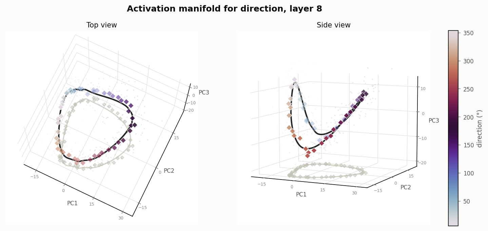
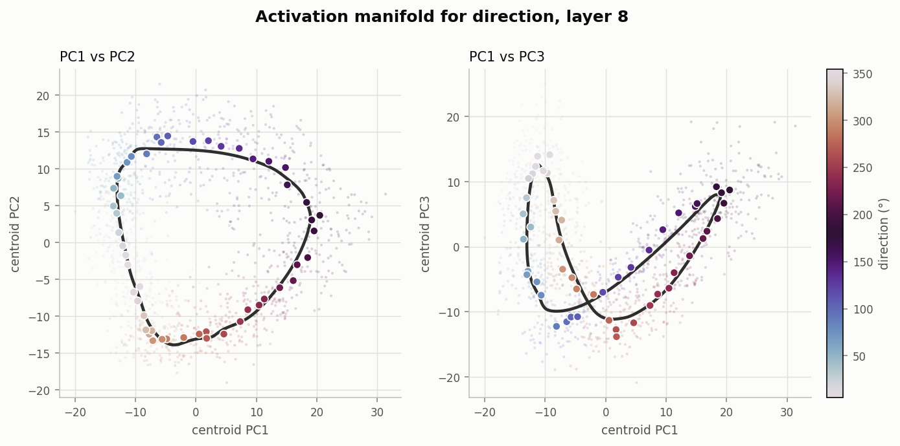
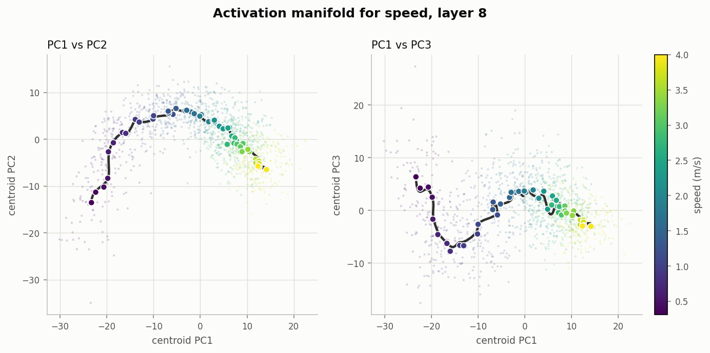
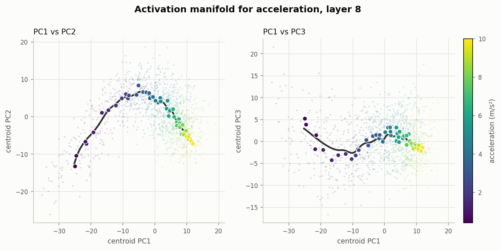
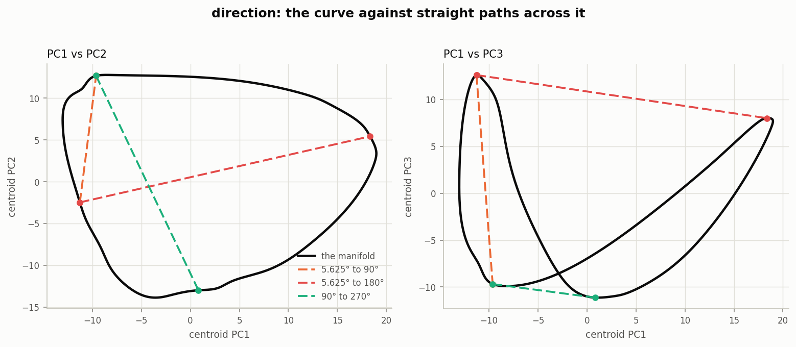
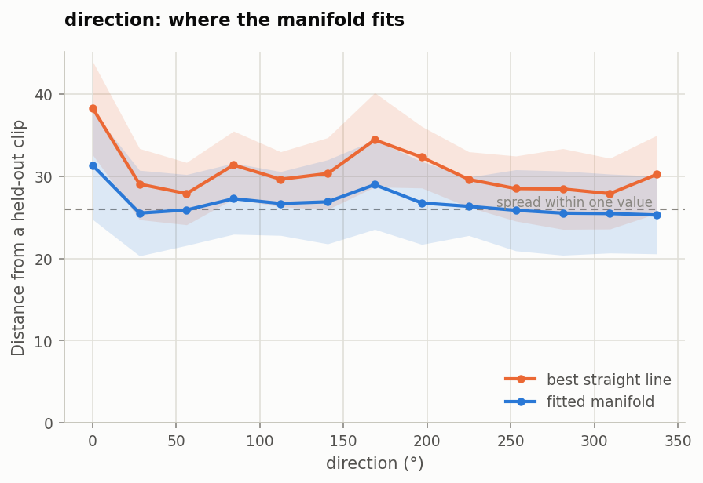
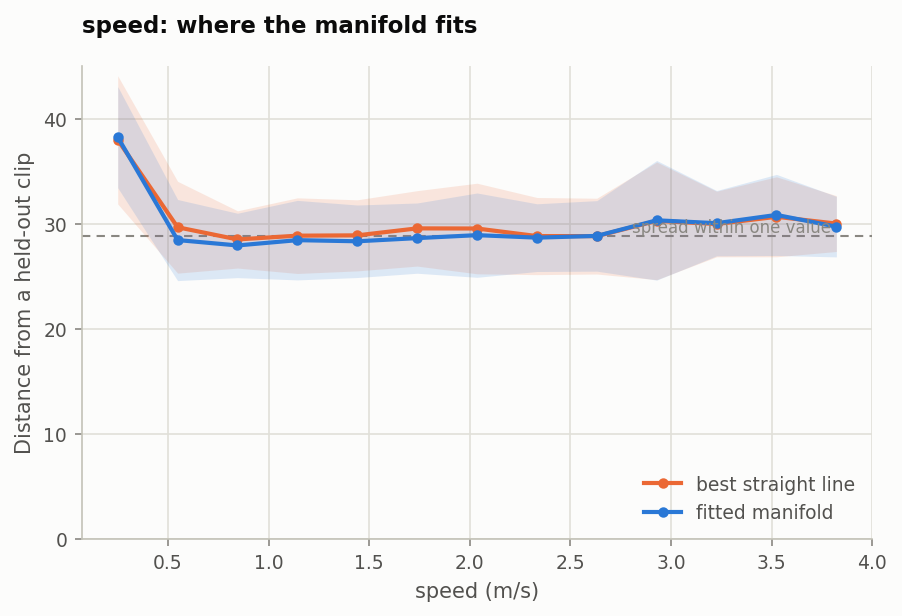

# The geometry of physical variables in activation space (Part 2, stage 1)

Parts 1.1–1.3 treat activation space as **flat**: a probe reads along a direction, and
steering writes coordinates into a subspace as though any combination were allowed.
This stage asks a different question — *what shape do the activations actually occupy?*
— and fits that shape as a curve.

It follows the method of Wurgaft et al., [*Manifold Steering Reveals the Shared
Geometry of Neural Network Representation and
Behavior*](https://arxiv.org/abs/2605.05115), Appendices A.3 and B.1. That paper
never uses V-JEPA, so this is a transfer of their method rather than a reproduction:
there are no numbers of theirs to match.

**The headline finding: direction is a circle, speed and acceleration are gently
bowed arcs — and the difference decides whether curved steering can help at all.**

---

## 1. What went in

### The data

Three synthetic datasets, each a single disk moving on a dark background, 16 frames,
256×256, 24 fps. Supplied with the task; not modified.

| Dataset | Values | Range | Spacing | Clips | Clips per value |
|---|---:|---|---|---:|---:|
| `speed` | 64 | 0.25 – 4.00 m/s | 0.0595 m/s, even | 1,536 | 24 |
| `acceleration` | 64 | 0.25 – 10.0 m/s² | 0.155 m/s², even | 1,536 | 24 |
| `direction` | 64 | 0° – 354.375° | 5.625°, even | 1,500 | 23–24 |

The structure is ideal for this method: the paper's recipe says *"bin by the concept
value and average each bin"*, and our data arrives pre-binned into 64 evenly spaced
values with two dozen clips each.

**One property of the data matters more than any configuration choice.** Within each
dataset the *other* variables also vary. The speed dataset varies direction and start
position; the direction dataset varies speed, acceleration and start position. Start
positions are continuous and unique per clip. The consequence:

| | clips scatter within one value | spread of the whole manifold | ratio |
|---|---:|---:|---:|
| speed | 28.7 | 12.4 | **2.3×** |
| acceleration | 29.1 | 11.4 | **2.6×** |
| direction | 25.9 | 17.9 | **1.4×** |

An individual clip sits further from its own value's average than the entire manifold
is long. **The curve we fit is a conditional mean threading a fat cloud, not a surface
the data lies on.** Every figure and number below should be read that way. The paper's
Mountain Car setting had position as nearly the only varying factor; ours does not.

### The features

Identical to Parts 1.1–1.3, so the same probes can judge the result:

| | |
|---|---|
| Encoder | `facebook/vjepa2-vitl-fpc64-256`, **frozen** |
| Layer | 8 — the paper's Physics Emergence Zone, the layer used throughout Part 1 |
| Representation | residual stream, **mean-pooled** over all 2,048 space-time tokens → 1,024 numbers per clip |
| Standardisation | z-scored with **training-split statistics only** |

### Splits

The same **five grouped folds** as Parts 1.1–1.3: each holds out 13 whole label
*values*, not random clips. The manifold is fitted on ~1,200 clips spanning 51 values
and asked about ~300 clips at 13 values it has never seen.

That makes the evaluation a genuine test of **interpolation**, which is exactly what
steering depends on — steering to 2.5 m/s is worthless if the curve only knows the
values it was fitted on.

One wrinkle: for speed and acceleration, **1 of the 13 held-out values falls outside
the fitted range** in two of the five folds. That is extrapolation, not interpolation,
and it is excluded from the reconstruction numbers and reported separately. Direction
has no such case — a periodic curve has no outside.

---

## 2. How the manifold is built

```
1. PCA the training activations to k dimensions
2. group clips by label value, average each group          →  64 centroids
3. fit one smoothing spline per PCA coordinate through the centroids,
   parameterised by the label, weighted by √(clips in the bin)
```

### The configuration, and why each value

| Choice | Value | Why |
|---|---|---|
| PCA dimension `k` | **7** (direction), **11** (speed), **12–14** (acceleration) | chosen per fold as the number of components holding **90% of the centroid variance** |
| Spline | cubic, smoothing | degree 3, as the paper uses |
| Direction's spline | **periodic**, period 360° | so 354.375° → 0° is an ordinary step |
| Smoothing `s` | **100–1000**, chosen per fold | picked by held-out error from a 7-point grid |
| Weights | √(bin count) | paper B.1; near-uniform here since all bins hold 23–24 |

**On `k`.** The paper uses 64 PCA dimensions. Ours needs far fewer, and the reason is
the fat cloud: the *clips* need 60–66 components for 90% of their variance, but the
*centroids* — the manifold itself — need only 4–6. Chasing the clips' variance would
mean fitting splines to dozens of dimensions of start position, which the curve does
not describe. So `k` is chosen on the centroids.

**On the periodic spline.** This is the concrete answer to the brief's instruction to
*"think carefully about the circular structure of direction"*, and it is justified by
measurement, not assumption. The distance between two direction centroids follows the
chord formula for a circle, `2R·sin(Δθ/2)`:

```
far/near distance ratio, noise-corrected:

  direction      19.6      a perfect circle predicts  20.4     ✓
  speed          61.6      a perfect straight line predicts 30.7
  acceleration   46.2      a perfect straight line predicts 30.7
```

Direction matches the circle prediction to within 4%. The scalars are ordered along a
path (PC1 correlates 0.93–0.96 with the value) but not evenly spaced — their far pairs
sit about twice as far apart as a uniform line predicts, meaning the representation
moves faster per unit at some parts of the range than others.

**On smoothing.** Not a free parameter and not chosen by eye. Neighbouring centroids
here are genuinely 0.6–1.5 apart while each carries 5.4–6.0 of sampling noise — so
threading a curve exactly through all 64 would be fitting noise. The smoothing is
selected on the inner validation split, and no fold chose a grid edge, so the range is
wide enough.

---

## 3. What we found

### The three shapes



*Direction at layer 8, two viewing angles of the same three components, with the curve
and centroids cast as a grey shadow on the floor — the paper's device for reading
depth in a static 3D plot. Faint dots are individual clips.*

**This figure makes the case for looking at geometry carefully.** In the **top view**
the ring is unmistakable: a closed loop with the colour running right around it and
meeting itself. In the **side view** the same object looks like an open U-shaped
curve. Had we only drawn the side view we would have concluded direction was an arc
like speed. The shadow gives the game away even there.



*The same object as flat panels, which is easier to measure by eye. Solid dots are the
64 centroids; the black line is the fitted spline; faint dots are clips.*

The left panel (PC1 vs PC2) shows the closed ring. The right panel (PC1 vs PC3) shows
it **folding back on itself** — the same fold the paper reports for Mountain Car, and
the reason a straight line between two angles can pass close to activations whose true
values are far apart.



Speed is a **gently bowed arc**, with the centroids crowding at the high end. That
crowding is the uneven spacing: a change of 0.1 m/s near 0.25 m/s moves the
representation further than the same change near 4 m/s.



Acceleration is the same story — an arc with the high values bunched. Its PC1 alone
holds 66.9% of the centroid spread and correlates **+0.926** with the acceleration
value, so the geometry is genuinely *about* acceleration, not a coincidence of some
other factor.

### Why the shape matters for steering



*The manifold in black; dashed lines are the straight paths between pairs of values —
what linear steering takes.*

The 5.625° → 180° chord goes **straight through the middle of the ring**, where no
clip has ever been. That is not an abstract concern; walking that line and asking a
probe what it sees gives:

```
t = 0.00     reads   0.8°    confidence 1.021
t = 0.38     reads   1.1°    confidence 0.261
t = 0.50     reads  13.0°    confidence 0.009   ← a state with no direction at all
t = 0.62     reads 180.3°    confidence 0.245
t = 1.00     reads 180.6°    confidence 1.004
```

The angle does not sweep from 0° through 90° to 180°. It sits at 0°, collapses, and
reappears at 180° — the "teleportation" the paper describes. A straight line between
opposite points on a circle passes through the centre, where the radius is zero and
the angle is undefined.

---

## 4. Evaluation

Four tests, all on clips whose label value the manifold never saw. Distances are in
standardised activation units.

| | **Direction** | **Speed** | **Acceleration** |
|---|---:|---:|---:|
| **E1** reconstruction — curve | **26.73 ± 0.28** | 29.19 ± 0.13 | 29.50 ± 0.67 |
| **E3** the same — best straight line | 30.60 ± 0.39 | 29.73 ± 0.18 | 29.98 ± 0.77 |
| **curve beats line by** | **+12.7%** | **+1.8%** | **+1.6%** |
| E1 baseline — nearest fitted centroid | 26.97 | 29.42 | 29.82 |
| E1 baseline — global mean | 31.61 | 31.42 | 31.28 |
| **E2** unseen value's centroid — curve | **6.62 ± 0.27** | **5.35 ± 0.15** | **5.29 ± 0.21** |
| E2 — nearest fitted centroid | 7.55 | 6.50 | 6.82 |
| **E4** probe-free readout | **8.96° ± 0.49** | **0.31 ± 0.01 m/s** | **0.98 ± 0.06 m/s²** |

### E3 — does the curve earn its curvature?

**This is the test that decides whether the rest of Part 2 has a premise**, and it
splits the variables cleanly.



*Distance from each held-out clip to the curve (blue) and to the best straight line
(orange), across the range. The dashed line is the spread of clips within a single
value.*

For direction the curve is clearly below the line everywhere. A line cannot be a
circle, and the 12.7% gap is that fact measured.



For speed the two curves lie **on top of each other**. The fitted manifold and a
straight line describe the held-out clips equally well.

**That is a real finding, not a disappointment.** It says the paper's argument is
variable-specific. Curved steering can only help where the geometry is curved, and for
speed and acceleration at this layer, it barely is.

### The floor, and the fact the manifold has reached it

Notice where the blue line sits in both residual figures: **on** the dashed
within-value spread. Once it is there, the remaining distance between a clip and the
curve is start position and the other physical variables — things no curve
parameterised by one variable could capture. The fit is as good as this
parameterisation allows; a fancier curve would not help.

This also explains why E1's absolute numbers look unimpressive next to the global-mean
baseline (26.7 vs 31.6 for direction — only 15% better). The manifold explains the
part of a clip that its label determines, which is a minority of the clip.

### E2 — the curve genuinely interpolates

For a value it was never given, `s(v)` lands **closer to that value's true centroid
than the nearest fitted centroid does** — 5.35 vs 6.50 for speed, 6.62 vs 7.55 for
direction. It is filling in between the training values, not memorising them. This is
the property steering needs.

### E4 — a decoder with no probe in it

Project a held-out clip onto the curve, read off the coordinate of the nearest point,
and you have decoded the physical variable **using only geometry**:

| | geometric readout | Part 1.1's linear probe |
|---|---|---|
| Direction | 8.96° | 4.4° circular MAE |
| Speed | 0.31 m/s | — |
| Acceleration | 0.98 m/s² | — |

Roughly half as accurate as a trained probe, from a curve that was never optimised to
decode anything. It is an independent confirmation that the fitted geometry captured
the real variable rather than some artefact.

---

## 5. Limitations

**The manifold is a conditional mean.** Clips scatter 1.4–2.6× further from the curve
than the curve is long. This is stated in every section above because it is the single
most important caveat, and because the figures would otherwise imply a tidiness the
data does not have.

**One variable at a time.** Each manifold is parameterised by one label. The other
factors varying in each dataset — start position especially — are not modelled, and
they are what the residual consists of.

**Only layer 8.** Chosen for consistency with Part 1. The geometry may well differ
elsewhere; Part 1.1 showed direction's readability changes considerably with depth.

**Extrapolation is untested.** The evaluation deliberately excludes the handful of
held-out values outside the fitted range. Steering to a value beyond the training
range is a different and unexamined question.

**A latent failure mode, caught.** scipy's spline fit does not always converge, and
when it fails it returns a curve with an enormous error *with a warning, not an
exception*. Acceleration's smoothing trace contained this:

```
smoothing:      0        1              10      100     1000
held-out err:  30.02   415,628,363.44  30.00   29.94   29.73
```

It did not win, but nothing would have stopped it. The selection now rejects any
candidate that reconstructs held-out clips worse than simply predicting the training
mean, with a test to match.

---

## 6. Reproducing it

```bash
python scripts/05_manifold.py --variable direction      # fit + evaluate, ~40 s on CPU
python scripts/figures/manifold.py --variable direction # the four figures
```

Writes `evaluation.csv` (per fold), `summary.csv`, `smoothing_trace.csv`, `run.json`
and `manifold_fold0.npz` to `artifacts/results/<variable>/manifold/`. The `.npz` holds
the PCA basis and spline coefficients, which is what the steering stage consumes.

Figures in this folder, four per variable:

| File | What it shows |
|---|---|
| `manifold3d_<v>.png` | 3D, two views, shadow floor — the paper's house style |
| `manifold_<v>.png` | flat PC1–PC2 and PC1–PC3, easier to measure |
| `manifold_chord_<v>.png` | the curve against straight paths across it |
| `manifold_residual_<v>.png` | curve vs line vs the within-value floor |

No GPU: the encoder is not run, only the cached features from `01_extract.py`.

---

## 7. What this sets up

The next stage steers along these curves and compares against Part 1.3's multi-probe
subspace method. Stage 1 already predicts the outcome, which is worth having on the
record beforehand:

- **direction** has real curvature, so manifold steering should beat linear steering
- **speed and acceleration** are nearly straight, so the two methods should roughly tie

A prediction made before the experiment is worth more than the experiment alone.
