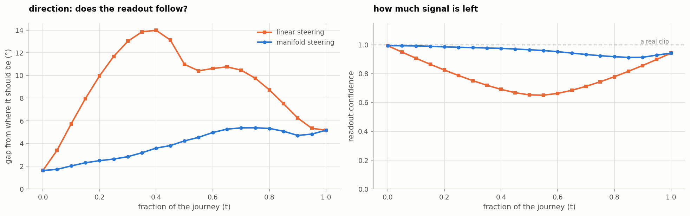
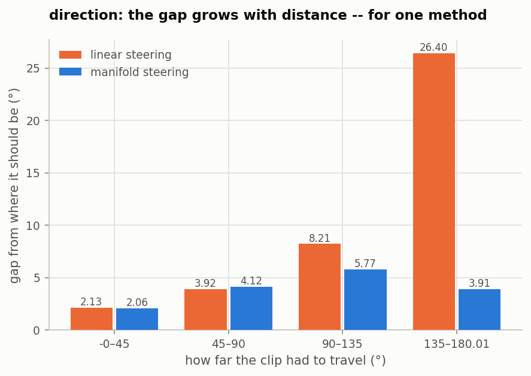
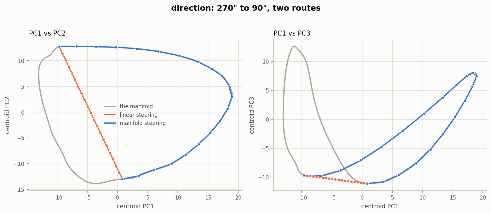
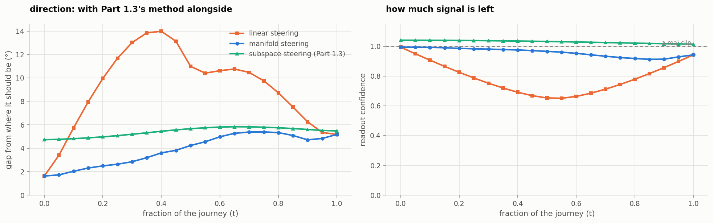

# Steering along the manifold (Part 2, stage 2)

[Stage 1](../activation-manifolds/README.md) measured the shape the activations
occupy: direction is a circle, speed and acceleration are gently bowed arcs. This
stage moves clips *along* those shapes instead of straight across them, and asks
whether it makes any difference.

It also answers the brief's final requirement — comparing against the multi-probe
subspace method of Part 1.3.

**The result splits by variable, exactly as stage 1 predicted. Manifold steering beats
linear steering by 59% for direction and loses by 19–38% for the scalars.** The
prediction was written down before the experiment was run.

---

## 1. The three methods

Every held-out clip starts **at its own value** `v₀` and travels to a fixed target
`v₁`, in 21 steps. At step `t` it is supposed to have reached
`v(t) = v₀ + t·Δ`, where `Δ` goes the short way round for direction.

```
linear      x*(t) = x + t·( s(v₁) − s(v₀) )      Goodfire eq. 1 — add the difference vector
manifold    x*(t) = x + s(v(t)) − s(v₀)          Goodfire eq. 2 — walk the fitted curve
subspace    x*(t) = V c*(v(t)) + x⊥              Part 1.3, re-solved at each step
```

**Linear and manifold are identical at `t = 0` and `t = 1`.** At the start both give
`x`; at the finish both give `x + s(v₁) − s(v₀)`. They differ *only in between* — which
is the paper's entire claim, and it means the headline measure cannot be an endpoint.
It has to be about the journey.

The first two **add** to the clip, so they reproduce it exactly at `t = 0` and carry
its residual all the way. The third **replaces**: it discards the clip's coordinates in
`V` and writes solved ones in their place. That difference turns out to matter — see
section 5.

`subspace` is an extension of paper C.12, not C.12 as written: that method jumps
straight to a target, and is turned into a path here so all three share an axis.

---

## 2. Setup

| | |
|---|---|
| Layer | 8, as in every other experiment here |
| Manifold | fitted on the fold's ~1,200 training clips (stage 1's procedure) |
| Evaluation probe | trained on the **held-out clips only**, R² 0.994–0.999 |
| Targets | 90° (direction), 2.0 m/s, 5.0 m/s² — the same targets Part 1.3 used |
| Waypoints | 21 (`t` = 0, 0.05, … 1); the paper uses 20 for Mountain Car |
| Subspace probes | 31 / 44 / 25 — whatever Part 1.3's own sweep found best per variable |
| Folds | the same five grouped folds as Parts 1.1–1.3 |
| Journeys | direction 5.6°–180°, mean 89° |

The five grouped folds hold out whole label *values*, so the manifold is fitted on 51
values and every clip steered here sits at one of 13 values it has never seen. The
probe judging the result was fitted on those held-out clips alone, so it knows nothing
of the manifold, the steering probes, or the activations that built either.

**What is measured.** At each step, how far the probe's reading is from `v(t)` — the
value the clip is supposed to have reached. A method that works sweeps smoothly; one
that doesn't hangs back and lurches.

Results are binned by **how far each clip had to travel**, because the methods are
expected to agree for short moves and diverge for long ones. They do.

One measure deliberately **not** used: distance from the path to the manifold. Manifold
steering preserves the clip's residual by construction, so that distance never changes
for it — reporting it would be measuring our own definition.

---

## 3. Direction — manifold steering wins



*Left: how far the readout is from where the clip should be, at each point of the
journey. Right: the readout's confidence — the length of the probe's (sin, cos)
output, which collapses towards zero in states with no directional signal.*

```
                    t=0    journey     t=0.5     t=1    confidence at t=0.5
linear             1.63      9.66     10.98     5.18          0.653
manifold           1.63      3.92      4.23     5.18          0.966
```

Linear steering's error rises to a **14° hump** at `t = 0.4` and falls back; manifold
steering climbs gently to 5° and stays. That hump is the paper's "teleportation": the
clip is not travelling, it hangs back and then lurches past.

The confidence panel says what is happening physically. Linear steering's readout sinks
to **0.653** by mid-path — the straight route is passing through states where the
directional signal is partly gone. Manifold steering never drops below **0.93**.

### And the effect is entirely about distance



| journey | linear | manifold | gain |
|---|---:|---:|---:|
| 0–45° | 2.13° | 2.06° | +3% |
| 45–90° | 3.92° | 4.12° | −5% |
| 90–135° | 8.21° | 5.77° | **+30%** |
| **135–180°** | **26.40°** | **3.91°** | **+85%** |

**Linear steering degrades with journey length; manifold steering does not.** Linear's
error climbs 12× across the four bins while manifold's barely moves. For a short hop
the chord and the arc nearly coincide and the two are indistinguishable — the 45–90°
bin even favours linear by 5%, within noise.

This is why the geometry matters and *when*. The win is a long-journey phenomenon, not
a blanket improvement.



*The same journey drawn on the manifold: one route follows the ring, the other cuts
across the middle, where no clip has ever been. Illustrative — a single path between
two centroids, with no held-out evaluation — but it is the picture of the 26.40°.*

---

## 4. Speed and acceleration — manifold steering loses

```
speed          linear 0.07 m/s     manifold 0.10 m/s      linear 38% better
acceleration   linear 0.25 m/s²    manifold 0.29 m/s²     linear 19% better
```

And the penalty grows with distance, in the opposite direction to direction's:

| speed journey (m/s) | linear | manifold | gain |
|---|---:|---:|---:|
| 0.02–0.49 | 0.05 | 0.05 | −1% |
| 0.49–0.95 | 0.05 | 0.06 | −10% |
| 0.95–1.42 | 0.07 | 0.09 | −32% |
| **1.42–2.0** | **0.12** | **0.20** | **−71%** |

Stage 1 predicted a tie here; what we get is a loss. The explanation is in stage 1's
numbers: the fitted curve beat a straight line by only **1.6–1.8%** in reconstruction.
That margin is mostly fitted noise rather than real curvature — so manifold steering
faithfully follows wiggles that are not there, taking a detour where the straight route
was correct. The longer the journey, the more wiggle it follows.

**This is the most useful finding in Part 2.** The paper's argument is
**variable-specific**, and stage 1's reconstruction test predicts which way it will go
before any steering is run. That gives a cheap rule: *fit the curve, check whether it
beats a straight line, and only bother with manifold steering if it does.*

---

## 5. Against Part 1.3's subspace method



```
direction           t=0    journey     t=0.5     t=1    error to target at t=1
linear             1.63      9.66     10.98     5.18          5.18
manifold           1.63      3.92      4.23     5.18          5.18
subspace           4.72      5.43      5.67     5.47          5.47
```

Three things stand out.

**The subspace method does not reproduce the clip at `t = 0`.** Steering a clip to
where it already is should do nothing, and for the two manifold methods it does
(`‖x* − x‖ = 0`). The subspace method returns something 4.72° away, because it
*overwrites* the clip's coordinates rather than adding to them — even when the target
is the clip's own value. This was invisible in Part 1.3, which only ever measured the
endpoint.

**Its error is nearly flat along the path** — about 5.4° regardless of `t`. It is not
tracking a trajectory at all; it lands on a solved point each time. That is what it was
built to do, and the flatness is the signature of it.

**It is the most robust method at long range.** At 135–180° it scores 6.09° against
linear's 26.40°, though manifold steering's 3.91° still beats it.

### Strengths, limitations, failure cases

| | Manifold steering | Subspace steering (Part 1.3) |
|---|---|---|
| **What it changes** | slides the clip along a 1-D curve | overwrites 62 free coordinates |
| **Preserves the clip?** | yes — exact at `t = 0`, residual carried throughout | no — replaces its coordinates unconditionally |
| **Where it wins** | long journeys on a genuinely curved variable (+85% at 135–180°) | robustness; flat error at any distance |
| **Where it fails** | variables with no real curvature — **loses 19–38%** on the scalars | intermediate states; no notion of a journey at all |
| **What it needs** | a fitted manifold, and curvature worth following | a probe sequence from Part 1.2 |
| **Naturalness at mid-path** | confidence 0.966 | confidence **1.033** — *higher* than a real clip |

That last row is worth dwelling on. The subspace method's confidence exceeds a real
clip's, because it writes an unnaturally clean signal into the probe subspace. It is
not moving the clip to a state resembling real clips at that value; it is overwriting a
readout. Both are legitimate interventions, but they are answering different questions,
and only manifold steering is constrained to produce states the encoder could plausibly
have produced itself.

---

## 6. Limitations

**We never run the model on the steered states.** Every number here is what a *probe*
reads. The encoder's remaining layers, and V-JEPA's predictor, are never executed on
the steered activations — the same limitation Part 1.3 carries. Doing so needs
per-token activations (~6 GB per layer) and a GPU session; we cached only the pooled
mean. So "steering works" means "an independent reader sees the change", not "the model
behaves differently".

**One target per variable.** 90°, 2.0 m/s, 5.0 m/s². Part 1.3's multi-target check
found its result stable across 8–9 targets, but that check has not been repeated here.

**The manifold is a conditional mean.** Clips scatter 1.4–2.6× further from the curve
than the curve is long. Steering moves the curve's point and carries the residual, so
whatever the residual encodes — start position, the other physical variables — travels
unchanged. A steered clip is therefore "this clip, relocated", not "a typical clip at
the target value".

**Layer 8 only**, as everywhere else in this project.

**No behaviour manifold.** The paper's most elegant result — that the activation and
behaviour geometries are isometric at r = 0.99 — needs a second manifold fitted to
output distributions. V-JEPA has no output distribution, so any behaviour space here
would be a readout we constructed. The brief does not ask for it, and building it would
have meant comparing our own construction against itself.

---

## 7. Reproducing it

```bash
python scripts/03_nullspace.py --variable direction        # supplies the subspace probes
python scripts/05_manifold.py --variable direction         # supplies the manifold
python scripts/06_manifold_steering.py --variable direction   # ~40 s on CPU
python scripts/figures/manifold_steering.py --variable direction
```

Writes `paths.csv.gz` (every clip at every waypoint), `summary.csv`,
`summary_by_journey.csv` and `run.json` to
`artifacts/results/<variable>/manifold_steering/`.

Figures in this folder, four per variable:

| File | What it shows |
|---|---|
| `steer_paths_<v>.png` | the two routes drawn on the manifold (cf. paper Fig. 7c) |
| `steer_tracking_<v>.png` | error and confidence along the journey |
| `steer_journey_<v>.png` | error against how far the clip had to travel |
| `steer_subspace_<v>.png` | with Part 1.3's method alongside |

---

## 8. What Part 2 concluded

**Direction has real curvature and steering along it works**: 59% lower error over the
journey, rising to 85% for clips crossing more than half the circle, with the readout
staying at 0.97 confidence where linear steering drops to 0.65.

**Speed and acceleration do not**, and following their fitted curves actively hurts.

**The two outcomes were predicted by a cheap test run beforehand** — whether the fitted
curve beats a straight line at reconstructing held-out clips. Direction: +12.7%. The
scalars: +1.6–1.8%. That test costs seconds and tells you whether the expensive method
is worth running.

**The paper's claim holds where its premise holds.** Geometry-aware steering is better
when the geometry is genuinely curved, and worse when it isn't — which is a more useful
statement than a uniform endorsement, and it is not one the paper makes, because all
four of its language tasks have curvature by construction.
