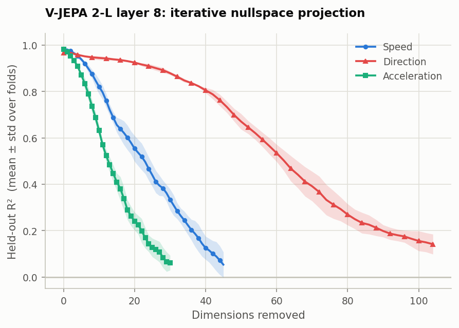
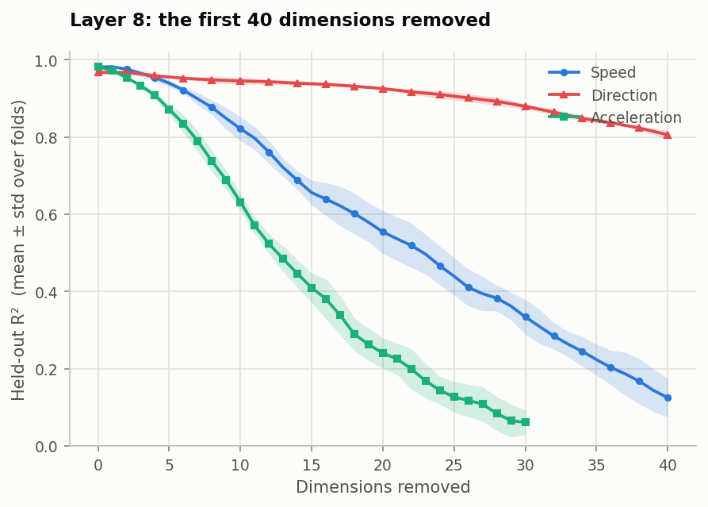

# Iterative nullspace probing (Part 1.2)

How many independent directions of V-JEPA 2's residual stream carry each physical
variable? At one layer, a probe is trained, the subspace it reads from is deleted,
and another probe is trained on what remains — until nothing readable is left. The
number of rounds survived is the variable's effective dimensionality; how slowly the
curve falls is its redundancy. This reproduces Appendix C.11 and Figures 4c, 22 and
23 of Joseph et al., [*Interpreting Physics in Video World
Models*](https://arxiv.org/abs/2602.07050).



*Held-out R² as directions are deleted from layer 8. Shaded bands are ±1 standard
deviation across 5 folds. Curves are drawn only where all five folds are still
running, so the bands always cover the same folds; individual folds continue further
(speed 46–58 rounds, direction 53–68).*

## Result

| Variable | K (probes) | Dimensions | Paper, Table 3 @ layer 8 |
|---|---:|---:|---:|
| Acceleration | 31.0 ± 2.3 | **31.0 ± 2.3** | not measured |
| Speed | 47.2 ± 4.9 | **47.2 ± 4.9** | 28 |
| Direction | 58.0 ± 5.7 | **116.0 ± 11.5** | 136 |

Direction's dimension count is `2K`, because its probe has two outputs and each round
deletes a plane rather than a line (paper C.11's own convention).

- **All three variables are high-dimensional.** Deleting the single best direction
  changes nothing measurable: averaged over folds, speed goes 0.981 → 0.982 and
  direction 0.967 → 0.967. Tens of directions must go before either becomes
  unreadable. This is the paper's central claim for this section and it reproduces
  clearly.
- **Direction needs roughly 2.5× as many dimensions as the scalars**, despite Part 1.1
  showing all three equally readable at this layer (R² 0.977–0.985). Equally
  decodable, very differently stored — the paper's qualitative finding.
- **Direction's 116 against the paper's 136** is a close quantitative match from a
  different dataset. Under Figure 22's looser threshold we get K = 38.8, which lands
  on §7.2's "roughly 40–50 features".
- **Speed's 47 against the paper's 28** is our largest discrepancy. The verification
  appendix shows this number moves to 34.6 with a more precise probe, so it is partly
  a property of the optimiser rather than of the encoder.

Under the second threshold the paper gives (Fig. 22's caption, which disagrees with
C.11's text):

| Variable | K at Fig. 22's threshold | Dimensions |
|---|---:|---:|
| Acceleration | 27.6 ± 2.2 | 27.6 |
| Speed | 42.6 ± 3.6 | 42.6 |
| Direction | 38.8 ± 2.7 | 77.6 |



*The same runs over the first 40 dimensions. Acceleration collapses first, speed
next; direction barely moves — after 30 dimensions are gone it is still at R² 0.88,
while acceleration has fallen to 0.04 by 35.*

## Setup

Everything here follows paper Appendix C.11. Where C.11 is silent or contradicts
itself, the choice is marked and justified.

| | |
|---|---|
| Layer | 8 — the Physics Emergence Zone, the layer of paper Fig. 4c |
| Features | mean-pooled residual stream, cached by Part 1.1's extraction |
| Probe | one linear layer, MSE; scalar output for speed and acceleration, (sin θ, cos θ) for direction |
| Optimiser | Adam, **lr 1e-3, wd 1e-4** — C.11's fixed values, no sweep |
| Epochs | 100 direction, 50 speed and acceleration (C.11) |
| Removal | `Q, _ = QR(Wᵀ)`, then `X ← X − X Q Qᵀ`, fitted on training clips and applied unchanged to the held-out clips |

Four decisions C.11 leaves open:

**The split.** C.11 specifies a single 80/20 split with a fixed seed, which cannot
produce the error bands its own Figures 4c and 23 show. We reuse Part 1.1's five
grouped folds — each a grouped 80/20 split holding out whole label values — which
gives the bands and keeps the evaluation consistent with Part 1.1. This is stricter
than the paper, whose 8 directions cannot be held out at all.

**Standardisation happens once**, before round 0, using training statistics only.
Re-standardising after a projection would partially undo it: if `x·q = 0` and each
coordinate is then rescaled by a diagonal `D`, then `(Dx)·q = x·(Dq)`, which is not
zero. The deleted direction creeps back while everything still appears to work.

**The stopping rule.** The paper gives two different thresholds for the same
experiment — C.11's text says direction R² < 0.1 and speed R² < 0.05, Figure 22's
caption says 0.3 and 0.1. We run to the stricter one and report `K` under both, so
neither reading is baked in. A threshold must also be crossed for **3 consecutive
rounds**: the paper reports direction's curve as a sawtooth, so a single dip would be
unreliable.

**Each round's basis is orthogonalised against everything removed so far**, and the
rank it actually adds is recorded rather than assumed. Adam's weights retain a
component along already-deleted directions — no gradient ever removes it, since the
data is flat there — which would otherwise inflate the dimension count. It also
guarantees the new direction lies inside the span the data still occupies, so the
rank genuinely falls by one per round. Verified: 1024 → 1004 → 964 → 918 after 0, 20,
60 and 106 removals.

**Acceleration is ours.** The paper never runs acceleration through this experiment.
We treat it exactly as speed and label it as an extension.

## Verification

- **Round-0 guard.** C.11's fixed weight decay of 1e-4 is a hundred times below the
  smallest value in Appendix B's grid that Part 1.1 swept. Before each run, both
  configurations are fitted and compared, so a curve that starts low because the probe
  is badly tuned cannot be mistaken for a variable that is hard to read. Gaps were
  +0.003 (speed), −0.001 (acceleration) and +0.012 (direction) — small enough that the
  curves start where Part 1.1 says they should.
- **Independent reimplementation.** A from-scratch loop using scipy's pivoted QR and
  sklearn's ridge, sharing no code with `nullspace.py`, reproduces the direction curve
  to **2.0e-08** over 24 rounds.
- **Saved bases.** Column counts match rounds exactly, orthonormality holds to 1e-15,
  and every probe's weights lie inside the basis built from them to 1e-16.
- **No leakage.** Across all five folds, no clip and no label value appears in both
  training and test. `r2_score` matches sklearn and `circular_mae` matches a
  brute-force loop to six decimals.
- **Probes are converged.** Quadrupling the epochs moves R² by at most 0.02 at every
  round tested; an exact solver gains at most 0.03. The decline is information
  disappearing, not the optimiser giving up.

## Limitations

**`K` is not a property of the representation alone.** It depends on how the probe is
fitted. With an exact ridge probe instead of C.11's Adam, direction's estimate falls
from 116 to 48 dimensions and speed's from 47 to 35. Any dimensionality number from
this method — including the paper's Table 3 — carries the optimiser inside it. What
survives both probes is the ordering: direction is far higher-dimensional than the
scalars either way.

**Each round removes very little of the representation.** A round deletes 0.3–0.5% of
total activation variance and the whole sequence only 20–31%. Combined with leakage
rising to 0.74–0.98 by the final rounds, this says a large part of each removed
direction is the probe's leftover random initialisation rather than signal.

**The sawtooth does not reproduce.** The paper reports direction's curve as a jagged
sawtooth and speed's as smooth (Fig. 23). Ours are both smooth. The verification
appendix documents what does produce that pattern.

**Our dataset is not the paper's.** Theirs has 392 clips and 8 directions; ours 1,500
clips and 64. Their probes see ~314 training clips for 1,024 dimensions, ours ~1,200.
The brief anticipates this: the aim is the methodology and qualitative findings, not
the numbers.

## Appendix

[**Verification appendix: the sawtooth, the probe, and the removal schedule**](sawtooth.md)
— three checks beyond the brief's ask: reproducing Figure 4c and identifying what
produces its dips, how much `K` depends on probe precision, and whether the removal
schedule matters.

## Reproducing it

```bash
python scripts/03_nullspace.py --variable speed            # ~6 min, CPU
python scripts/03_nullspace.py --variable acceleration     # ~5 min
python scripts/03_nullspace.py --variable direction        # ~14 min
python scripts/figures/nullspace.py                        # the two figures above
```

Each run writes `rounds.csv`, `summary.csv`, `dimensionality.csv`, `run.json` and
`bases.npz` to `artifacts/results/<variable>/nullspace/`. `bases.npz` holds every
round's probe weights, the accumulated orthonormal basis and the standardisation
statistics — which is what Part 1.3's steering needs.

No GPU: the probes are 1024→1 or 1024→2 linear models, and the loop is sequential, so
a GPU is slower than a CPU here.
