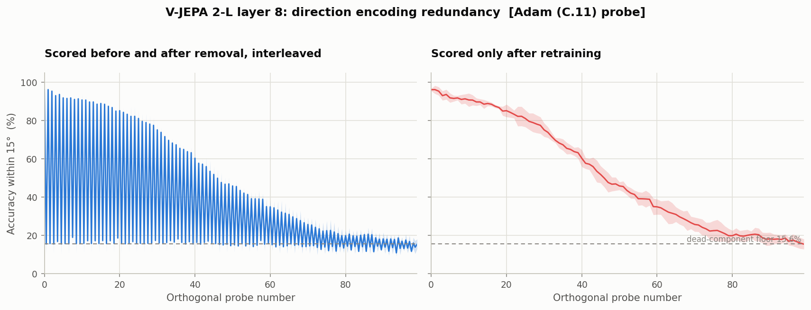
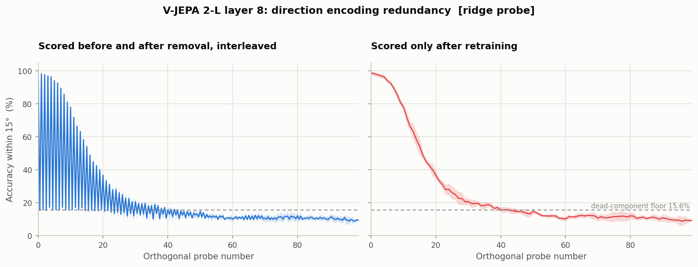
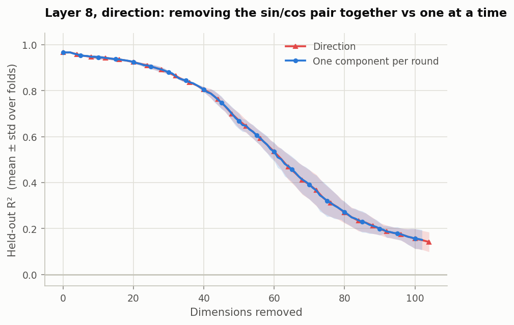

# Verification appendix — Part 1.2

Three checks that go beyond what the brief asks for. The brief's ask is the
dimensionality and redundancy result, which is in the [main write-up](README.md).
These exist because one part of the paper's Part 1.2 did not reproduce, and it
seemed worth finding out why rather than recording it as a gap.

- [A. The sawtooth](#a-the-sawtooth) — reproducing paper Figure 4c, and what produces its dips
- [B. Probe precision](#b-probe-precision) — how much `K` depends on how the probe is fitted
- [C. Removal schedule](#c-removal-schedule) — does deleting sin and cos together change the answer?

---

## A. The sawtooth

The paper reports that direction's curve "exhibits a characteristic sawtooth pattern
across successive orthogonalizations (Fig. 4c), consistent with direction being
encoded via approximately sinusoidal feature pairs (e.g. sine–cosine components) — a
pattern that we see uniquely in motion direction and not speed" (§7.2).

Our curves show no such pattern. Measured as the share of energy at period 2 — where a
sawtooth must put it — against the average frequency:

| Run | period-2 power | a sawtooth needs |
|---|---:|---|
| Direction, C.11 as specified | 0.00–0.15× | ≫ 1× |
| Direction, one component per round | 0.02–0.27× | ≫ 1× |
| Direction, exact ridge probe | 0.04–0.15× | ≫ 1× |
| Speed, C.11 | 0.00–0.13× | ≫ 1× |

The detrended lag-1 autocorrelation is *positive* in every case (+0.16 to +0.68),
meaning smooth excursions; a sawtooth would be near −1.

### The mechanism the paper describes

A sawtooth by paired features needs a specific cycle: a probe finds a complete
(sin, cos) pair; erasing one half leaves it unable to read the angle, so the score
dips; the next probe finds a fresh pair and the score bounces back.

Two things in our data prevent that cycle.

**C.11 deletes both halves in the same round.** The probe has two outputs, so `QR`
returns two columns and both are removed, jumping straight from one complete pair to
the next. The half-erased state the cycle needs never occurs. We therefore also ran
the experiment deleting **one component per round, alternating sin and cos** — see
[section C](#c-removal-schedule). It produced no sawtooth either.

**Nothing dies when a direction is deleted.** Measured directly: after erasing sin's
readout direction, a freshly trained probe recovers sin at R² 0.966, down from 0.981.
Erasing sin's directions for 30 consecutive rounds left **cos entirely untouched**:

| Rounds erasing only sin | R² sin | R² cos |
|---:|---:|---:|
| 0 | 0.968 | 0.956 |
| 10 | 0.924 | 0.960 |
| 20 | 0.825 | 0.962 |
| 30 | 0.438 | **0.960** |

In our activations sin and cos occupy separable subspaces. There is no pairing to
break, so there is no dip, so there is nothing to bounce back from.

### What does produce it

The dips appear as soon as a probe is scored on activations from which **its own**
readout subspace has already been projected out. That probe's weighted sum is zero by
construction, so it emits only its bias — for direction, a single fixed angle.

Its accuracy then falls to an arithmetic floor. With the sin output zeroed,
`atan2(constant, cos)` can only ever return 0° or 180°, so the probe is right exactly
on the directions within 15° of those two:

| Dataset | reachable angles | floor |
|---|---|---:|
| Paper's 8 directions | 0°, 180° | **25.0%** |
| Our 64 directions | 0°, 180° | **15.6%** |

Running the loop and interleaving the two kinds of score:



*Direction at layer 8, 5 folds × 100 probes, one component removed per round, C.11's
Adam probe. Both panels are the same run, the same removals and the same metric —
they differ only in whether the probe is retrained before being scored.*

```
sawtooth strength      retrained only  0.07x      interleaved  78.57x
```

| | Paper's Fig. 4c | Ours (left panel) |
|---|---|---|
| Peak at probe 0 | ~99% | 96.1% |
| Dips | pinned ~20–25% | pinned **15.0% ± 1.6** |
| Predicted floor | 2/8 = **25.0%** | 2/64 = **15.6%** |
| Envelope at probe 100 | ~22% | 15.4% |
| Sawtooth visible to probe | ~55 | ~60 |

The dips land on the predicted floor to within 0.6 percentage points. That number is
pure geometry — it follows from `atan2` and the number of directions in the dataset,
and it is the one quantity that *should* differ between the paper's data and ours.
It differs by exactly the predicted amount.

### What can and cannot be concluded

We can reproduce Figure 4c's sawtooth, and in our data its dips are an arithmetic
floor rather than a property of the encoder.

We cannot conclude that this is what produced the paper's figure. C.11 never states
when scoring happens relative to projection, so this remains inference. What can be
said is that this mechanism predicts the period, the envelope and the floor value,
while the paired-feature account did not produce an oscillation under any of the five
conditions tested: C.11 as specified, one component per round, an exact ridge probe,
hand-built discrete sin/cos pair structure, and training sets shrunk to 300, 120 and
60 clips to force overfitting.

A side result from the last of those: with 60 training clips the probe memorises
perfectly (train R² 1.000, test 0.755) and deleting the first few directions *raises*
held-out accuracy to 0.941. Removing directions acts as a regulariser. Real, but
one-directional — it produces a rise, not an oscillation.

---

## B. Probe precision

C.11 specifies Adam. Adam's weights begin at a random initialisation that no gradient
ever fully removes, so the direction handed to the projection is part signal and part
leftover noise. Ridge's solution lies entirely in the data's row space, so its
direction is all signal. Running the identical loop both ways:

| Variable | Adam (C.11) | Ridge (exact) | change |
|---|---:|---:|---:|
| Speed | 47.2 ± 4.9 | **34.6 ± 4.8** | −27% |
| Acceleration | 31.0 ± 2.3 | **34.8 ± 4.3** | +12% |
| Direction | 116.0 ± 11.5 | **48.4 ± 5.7** | **−58%** |

Three consequences.

**`K` is not a property of the representation alone.** Direction's estimate more than
halves on identical data at an identical layer under an identical stopping rule,
changing only how the probe is fitted.

**One of our findings does not survive.** Under Adam, acceleration looked
lower-dimensional than speed (31 vs 47); with an exact probe they are identical
(34.8 vs 34.6). That gap was an artifact, and the main write-up reports them as
equally redundant.

**The paper's claim does survive.** Direction needs far more dimensions than the
scalars either way — 116 vs 47/31 under Adam, 48 vs 35/35 under ridge.

The same comparison on the Figure 4c reproduction:



| | Ridge | Adam (C.11) | Paper's Fig. 4c |
|---|---:|---:|---:|
| Accuracy at probe 99 | 9.3% | 15.4% | ~22% |
| Floor crossed at probe | ~40 | ~95 | ~90 |
| Sawtooth visible to probe | ~35 | ~60 | ~55 |

Ridge destroys the representation in about a third of the probes, because every
direction it deletes is pure signal. The Adam version is both the faithful one and the
closer match to the paper's figure, which is consistent with the paper having used
Adam.

---

## C. Removal schedule

Does it matter whether direction's sin and cos axes are deleted together or one per
round? C.11 deletes both; the sawtooth mechanism requires one at a time.

| Schedule | K (probes) | Dimensions | Fig. 22 threshold |
|---|---:|---:|---:|
| Two per round (C.11) | 58.0 ± 5.7 | **116.0 ± 11.5** | 77.6 ± 5.4 |
| One per round, alternating | 116.4 ± 12.7 | **116.4 ± 12.7** | 77.0 ± 5.6 |



The two agree to within half a dimension. The schedule changes how many probes are
trained, not how much of the representation carries direction — a useful robustness
check on the headline number, since it means 116 is not an artifact of the removal
order.

One implementation note, recorded because it is an easy mistake: taking `Q`'s *first*
column every round does not alternate. It chases the sin axis forever and leaves cos
untouched, so R² plateaus near 0.45 — half the outputs still readable — while
appearing to run correctly. The alternation must rotate the column index, and each
round's `Q` comes from a freshly trained probe, not from the round that introduced the
pair.

---

## Reproducing the appendix

```bash
# Figure 4c: 100 probes, one component per round, no early stop
python scripts/03_nullspace.py --variable direction --dims-per-round 1 \
                               --max-rounds 100 --no-stop
python scripts/figures/figure4c.py

# the ridge comparison
python scripts/03_nullspace.py --variable direction --probe ridge \
                               --dims-per-round 1 --max-rounds 100 --no-stop
python scripts/figures/figure4c.py --run nullspace_ridge_dims1_nostop

# probe precision, all three variables
python scripts/03_nullspace.py --variable speed --probe ridge
```

Diagnostics write to their own directory (`nullspace_ridge`, `nullspace_dims1`,
`nullspace_dims1_nostop`) so the faithful C.11 results are never overwritten.
