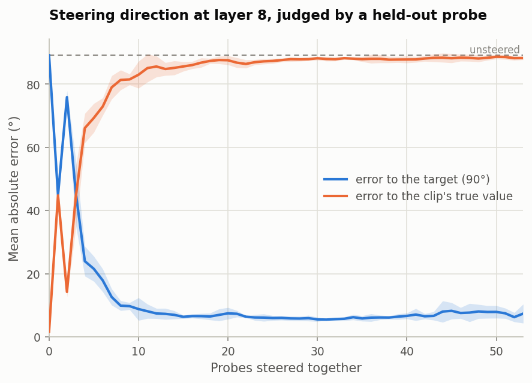
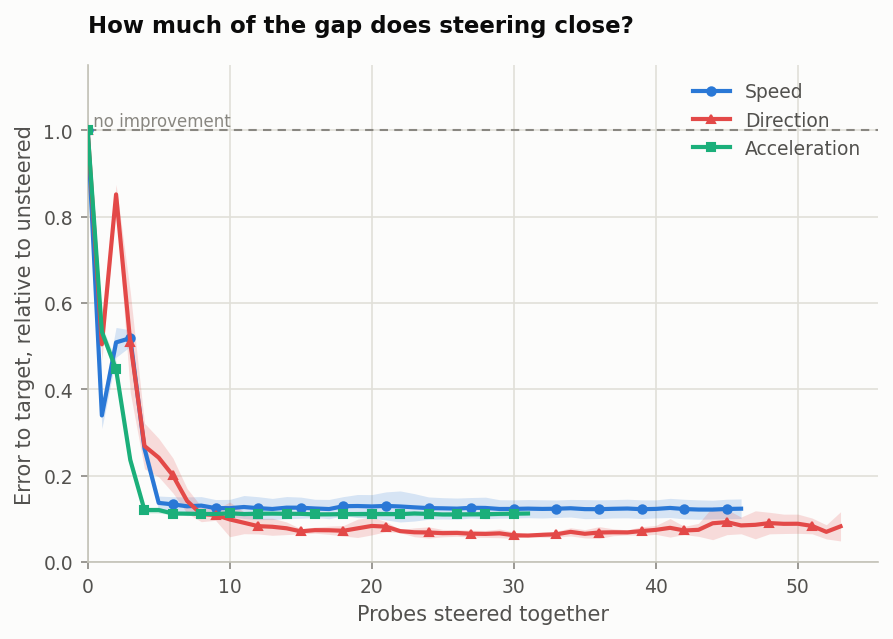

# Multi-probe subspace steering (Part 1.3)

Parts 1.1 and 1.2 ask what is *readable*. This one asks what is *writable*: reach into
the activations, overwrite a physical variable, and ask a probe that had no part in
building the intervention what it now sees. This reproduces Appendix C.12 and
Figure 24 of Joseph et al., [*Interpreting Physics in Video World
Models*](https://arxiv.org/abs/2602.07050).



*Direction at layer 8, steered toward θ\* = 90°. Blue falls as more probe directions
are moved together; orange is the check that it means something — see below. Bands
are ±1 standard deviation across 5 folds.*

## Result

| Variable | Unsteered | Best | at | Gap closed | Paper Fig. 24 |
|---|---:|---:|---:|---:|---|
| **Direction** | 89.08° | **5.47°** | 31 probes (62 dims) | **93.9%** | 82.9° → 11.9° at 20 probes |
| Speed `[OURS]` | 0.95 m/s | **0.12 m/s** | 44 probes | 87.8% | not measured |
| Acceleration `[OURS]` | 2.47 m/s² | **0.27 m/s²** | 25 probes | 89.0% | not measured |

The paper only ever steers direction; speed and acceleration are ours, and exist
because Part 2 must compare spline steering against this method for all three.

- **Direction reproduces the paper and slightly beats it** — 5.5° against 11.9°,
  judged by an evaluation probe that reached R² 0.997 (theirs: 0.99). The curve has
  Figure 24's shape: a steep fall over the first ten probes, then a plateau.
- **The paper's central claim holds.** One probe direction leaves 44.9° of error — it
  closes only half the gap. Roughly ten directions must move together before steering
  works. There is no single dial for direction, unlike refusal in language models,
  which is controllable through one direction (the paper's comparison).
- **The scalars behave the same way**, and saturate sooner: acceleration is within
  10% of its best by **4** probes and speed by **6**, against **25** for direction.
  That ordering matches Part 1.2's dimensionality result — direction needs more of
  the representation moved because more of it is carrying direction.



*Degrees, m/s and m/s² cannot share an axis, so each curve is divided by its own
unsteered error: 1.0 means steering achieved nothing, 0 means the target was reached
exactly. This is the baseline Part 2's spline steering has to beat.*

## Why the numbers mean something

Steering is easy to fool. Solve for the probes to read θ\*, then ask those same probes
what they read, and they will say θ\* to machine precision — because they were made to.
Three things guard against that.

**The evaluation probe never touched the intervention.** Following C.12 p. 33, it is
trained only on the held-out clips, so it has seen neither the steering probes nor the
activations that built the subspace. It reads unsteered clips at R² 0.994–0.999.

**Error to the clip's own label must rise as error to the target falls.** If both
improved, the target would be going into a corner of the space the evaluation probe
happens to read but the representation does not use — writing a note to the probe
rather than changing the encoded variable. Measured:

| Variable | to target | to truth |
|---|---|---|
| Direction | 89.08° → **5.47°** | 1.63° → **87.91°** |
| Speed | 0.95 → **0.12** m/s | 0.05 → **0.96** m/s |
| Acceleration | 2.47 → **0.27** m/s² | 0.18 → **2.45** m/s² |

Each rise is almost exactly the fall. The representation is being overwritten.

**It is not an artifact of the chosen target.** Repeating the sweep over 8–9 evenly
spaced targets: direction closes 93.9% ± 0.1%, acceleration 90.7% ± 1.6%, speed
89.7% ± 1.7%.

## Setup

| | |
|---|---|
| Layer | 8, the same as Parts 1.1 and 1.2 |
| Steering probes | Part 1.2's C.11 sequence, trained on the fold's 80% |
| Subspace | `V, _ = QR([W₁ᵀ … W_Kᵀ])` (C.12 eq. 8) |
| Steering | `c = Vᵀx`, `x⊥ = x − Vc`; solve `(WV)c* = t − b`; `x* = Vc* + x⊥` |
| Evaluation | a probe trained on the held-out 20% only, same C.11 recipe |
| Targets | 90° (direction), 2.0 m/s, 5.0 m/s² — the paper's θ\* = 90°, mid-range for the scalars |
| Folds | the same five grouped 80/20 splits as Parts 1.1 and 1.2 |

Step 2 is an exact solve, not an optimisation. Every probe's weights lie inside
`span(V)`, so `W x⊥ = 0` — the probes are blind to the remainder — and "every probe
predicts y\*" reduces to a square linear system, `K × outputs` equations in as many
unknowns. `c*` does not depend on `x`: every clip's readable coordinates are
overwritten with the same vector, and only `x⊥` keeps the clips distinct.

Three decisions the paper leaves open:

**The split.** C.12 uses a single random 70/30 (240 train, 103 test). We reuse our
five grouped folds, which gives error bands a single split cannot and is stricter:
the evaluation probe's angles never appear in the steering probes' training data. The
paper's 8 directions make that impossible for them.

**Probe weights are cleaned before stacking.** Probe *k* was trained after *k*
subspaces were deleted, so along those directions its training data was exactly zero —
and whatever weight Adam left there (its random initialisation, which no gradient ever
touched) contributed nothing to any number Part 1.2 reported. It matters here because
steering evaluates every probe on the *same* activations, and an uncleaned Adam probe
reads untouched activations quite differently from the reduced ones it was fitted on —
by up to 1.6 on a target living in [−1, 1]. Removing that component is a no-op on the
data the probe was fitted and scored on, which is asserted in
[`tests/test_steering.py`](../../tests/test_steering.py). A ridge probe needs no
cleaning; its leakage is exactly zero.

**Only probe counts every fold reached are reported.** Folds run to different
sequence lengths (direction 53–68), so the tail of the sweep would average over
fewer and fewer folds and its bands would not be comparable.

## What the paper does not report

**The intervention is large.** Reaching direction's best score moves each clip
**60%** of its own length; speed's best moves 39%, acceleration's 34%. Even the
ten-probe point moves direction by 43%. These activations are well outside anything
the encoder would produce from a real video, so "a probe reads the target" is a
weaker statement than it first appears — the evaluation probe is a linear readout and
will extrapolate happily, but nothing here shows the *encoder* would behave sensibly
on such an input. The `displacement` column records this for every point.

**Direction's curve is not monotonic at the start.** Two probes are consistently
*worse* than one, in every fold:

| probes | fold 0 | fold 1 | fold 2 | fold 3 | fold 4 |
|---|---:|---:|---:|---:|---:|
| 1 | 43.9 | 49.2 | 46.7 | 40.3 | 44.4 |
| **2** | **77.8** | **73.9** | **78.2** | **73.9** | **75.4** |
| 3 | 56.0 | 31.5 | 41.9 | 41.9 | 55.4 |

Consistent across folds, so not noise. It is specific to direction — the scalars fall
monotonically — which points at the two-output structure: satisfying two probes'
worth of sin/cos constraints at once admits a solution that partly cancels. We have
not run this down, and it is flagged rather than explained.

## Reproducing it

```bash
python scripts/03_nullspace.py --variable direction        # Part 1.2, supplies the probes
python scripts/04_steering.py --variable direction --multi-target 8
python scripts/figures/steering.py                         # once all three are done
```

About 4 minutes on CPU for all three, since the steering probes already exist and each
probe count costs only one solve. Each run writes `sweep.csv`, `summary.csv` and
`run.json` to `artifacts/results/<variable>/steering/`.

`04_steering.py --eval-half` runs the stricter variant where the evaluation probe is
fitted on half the held-out clips and judges the other half; the paper fits and judges
on the same clips, which is the default here so the numbers stay comparable.
